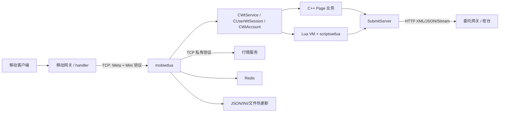
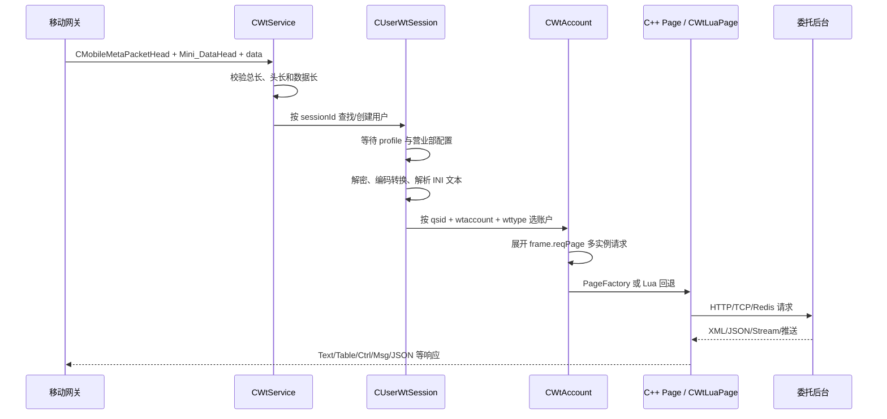
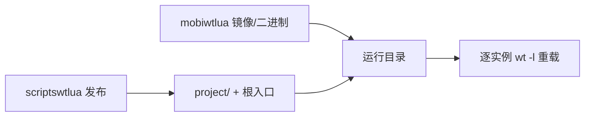

# mobiwtlua 项目业务知识与协议（AI 上下文版）

> 本文件是理解、分析和修改 mobiwtlua 时的首要上下文。AI 应先依据本文建立系统模型，再使用源码验证具体实现。源码与本文冲突时以源码为准。

## 0. AI 使用说明

### 0.1 系统定位

`mobiwtlua` 是 C++ 宿主与 Lua 业务共同组成的交易接入编排服务。它接收移动网关的 Meta/Mini 二进制请求，建立用户和交易账户上下文，按 PageId、CommandId 和请求类型路由到 C++ Page 或 Lua，访问委托柜台、行情、Redis 及其他 HTTP 服务，再生成客户端可识别的 Text、Table、Ctrl、Msg、JSON 等响应。

### 0.2 必须牢记的范围边界

- 不整理、不推断 `project/` 内部 Lua 业务实现。
- 生产中的 `project/` 由独立 `scriptswtlua` 项目更新替换。
- 本文件只描述 `mobiwtlua` 与 `scriptswtlua` 之间的加载入口、函数签名、序列化字段、返回类型和热更新协议。
- 根 Lua 入口固定为工作目录下的 `wt_handleclientreq.lua`；它再加载 `project/`。
- `lib/` 是外部 ZZPublic 子模块；`tmp/` 是构建中间产物；`Test/` 不在生产链路中。
- 大部分 C/C++ 和 Lua 源文件是 GB18030/GBK 编码，读取中文注释时应先转 UTF-8。

### 0.3 修改前的定位顺序

1. 网络接入与进程初始化：`mobiwt.cpp`。
2. Meta 包接收：`src/WtService/WtService.cpp`。
3. 用户级解密、profile 和账户选择：`src/WtService/WtUser.cpp`。
4. 账户级实例展开和 Page/Lua 路由：`src/WtService/WtAccount.cpp`。
5. 固定 PageId 映射：`src/WtService/WtBasePage.cpp`。
6. 柜台 HTTP 请求/响应：`src/SubmitServer/SubmitServer.cpp` 与 `Cmd*.cpp`。
7. Lua 桥接：`src/WtLua/WtLuaManager.cpp`、`src/WtService/WtLuaPage.cpp`。
8. 协议常量：`common/Include/NetClient/MobileMetaProt.h`、`Hexin.h`、`include/WtService/DefineId.h`。
9. 配置和生产行为：`deploy/`、`Resource/`。

### 0.4 核心调用链

```text
main
  -> CMobiWt::start
  -> OnNewClientSession
  -> CWtService::OnSessionReceiveMsg
  -> CUserWtSession::processClientReqMsg
  -> CUserWtSession::processUserRequest
  -> CWtAccount::processUserRequest
  -> CWtPageFactory::create
       -> C++ Page::onRequest
       -> 或 CWtLuaPage::onRequest
  -> CSubmitServer::send / 行情 / Redis
  -> Page 或 Lua 应答处理
  -> CUserWtSession::sendPacketToUser
  -> CWtService::sendPacketToUser
```

### 0.5 协议不变量

- Meta 与 Mini 结构按 1 字节对齐；不能随意改变字段顺序、宽度或端序。
- `Mini_DataHead.m_nType` 是复合位域；修改任何掩码都可能同时破坏客户端、移动网关和服务端。
- PageId、FetchType、CommandId、DataId 是跨模块/跨项目协议，不得复用旧值改变语义。
- Lua 全局入口固定接收 5 个参数、返回 3 个值。
- Lua 序列化字段名是 `mobiwtlua` 与 `scriptswtlua` 的 ABI。
- C++ Page 工厂未命中时会回退 Lua，这是主要业务扩展机制。
- Lua 热重载替换整个 VM，Lua 全局状态不会保留。
- 新增 SubmitType 必须同时具备 handler 映射、请求构造、响应解析和业务回调。

### 0.6 本文件目录

1. 架构与模块
2. 业务流程
3. 通信与数据协议
4. Lua 运行时与 scriptswtlua 契约
5. 配置、部署与运维
6. 业务标识符索引
7. 事实来源与维护规则

## 架构与模块

### 1. 运行时拓扑



服务本身只监听来自移动网关/handler 的连接，并不直接面向手机客户端。默认监听 `127.0.0.1:9531`，生产启动脚本通常绑定 `0.0.0.0` 并启动多个连续端口实例。

### 2. 启动生命周期

入口位于 [`mobiwt.cpp`](mobiwt.cpp)：

1. Release 模式限制虚拟地址空间为 4 GiB，避免泄漏吃光宿主机内存。
2. 解析启动参数，计算构建时间，安装 `SIGALRM/SIGTERM/SIGINT/SIGPIPE/SIGSEGV/SIGUSR2` 处理。
3. 创建日志目录并构造 `CMobiWt`。
4. `CMobiWt::start()` 先监听 TCP，再初始化 libevent。
5. 初始化系统信息、控制台、远程打印、异步文件、JSON/INI 配置和认证中心 RSA 公钥。
6. 初始化 Lua、委托网关、营业部管理器、HTTP、行情、Redis、快速计数器。
7. 注册监听 fd 和 1 秒定时器，进入 `event_dispatch()`。
8. 收到退出信号后跳出事件循环并释放行情管理器、定时器等资源。

初始化顺序具有业务意义：Lua 和营业部配置可用之前，客户端请求会进入 pending 队列；营业部配置与用户 profile 就绪后再按原顺序处理。

#### 启动参数

| 参数 | 含义 | 默认值 |
|---|---|---|
| `-l` | 监听端口 | `9531` |
| `-b` | 绑定 IP | `127.0.0.1` |
| `-m` | 允许连接的上游 master IP；0 表示不限制 | `0` |
| `-t` | HTTP/netfetch 超时秒数 | `0`，由 HTTP 实现解释 |
| `-i` | 本实例 ID | `0` |
| `-d` | 配置目录 | `WT_CONF_PATH` |
| `-x` | 日志目录 | `WT_LOG_PATH` |
| `-v` | 输出版本和构建时间 | - |

### 3. 会话对象层级

| 对象 | 生命周期 | 主要职责 |
|---|---|---|
| `CMobiWt` | 进程级 | 初始化、监听、事件循环、配置、控制台和 Lua 重载 |
| `CWtService` | 每个上游 TCP 连接 | 解析 Meta 包；保存用户哈希；发送 profile、路由、日志和业务响应 |
| `CUserWtSession` | 每个 `sessionId` | 保存同花顺账号、设备信息、用户属性、请求 pending 队列和多个委托账户 |
| `CWtAccount` | 每个交易账户/账户类型 | 登录状态、营业部、URL 前缀、市场/资金/持仓缓存、页面对象和 Lua 页面 |
| `CWtBasePage` 子类 | 通常每个业务请求 | 构造 Submit 请求、解析应答、维护分页/交互式状态并回客户端 |

`CWtAccount` 同时维护普通和两融登录状态，状态值为：`IDLE → LOGINING → LOGINED`，失败、删除、登出分别为 `LOGINFAILED/DELETE/LOGOUT`。

### 4. 生产业务模块

| 目录 | 业务职责 |
|---|---|
| `src/WtService` | 核心编排；登录、资产/持仓、委托/成交、买卖、撤单、转账、条件单、国债、风险、访问控制、消息替换等 |
| `src/SubmitServer` | 将内部强类型请求转换成委托后台 URL/POST；解析 XML、JSON、流式响应 |
| `src/WtLua` | Lua VM、C 函数注册、脚本加载/重载、调用栈和文件更新回调 |
| `src/WtLuaRet` | Lua userdata 返回对象：Gate、ThirdParty、Log、Msg、Text、Ctrl、Table、JSON |
| `src/WtGate` | 委托网关配置、加权轮询、健康检查、故障摘除与恢复 |
| `src/YybManager` | 营业部总表、代理和动态更新 |
| `src/YybInfo` | 普通、两融、CTP、境外等营业部对象与地址/能力信息 |
| `src/YybInfoManager` | 各类营业部加载、查找和负载均衡管理 |
| `src/HqService` | 行情主站连接、登录、心跳、成交预测注册和推送 |
| `src/Db` | Redis 异步查询客户端和回调映射 |
| `src/Cache` | Lua/C++ 共享请求缓存 |
| `src/ClientDataHandle` | 将业务结果封装成客户端 Text/Table/Msg/Ctrl/JSON 包 |
| `src/Crypt` | 认证中心 RSA 公钥加载、版本更新和加密 |
| `src/Asyncdns` | 异步域名解析 |
| `src/HttpClient` | curl/libevent HTTP 请求封装 |

### 5. C++ 页面业务目录

页面工厂 [`CWtPageFactory::create`](src/WtService/WtBasePage.cpp) 优先处理固定 PageId：

| 页面类 | 业务 |
|---|---|
| `CWtLoginPage` / `WtCTPLoginPage` | 普通、两融、token、自动、组合、期货登录 |
| `CWtResetPwdPage` | 交易/通讯/资金密码修改与强制修改 |
| `CWtQuAssetsPage` / `CWtQuStockPage` / `CWtQuAssetsStockPage` | 资金、持仓、资金+持仓 |
| `CWtQuWeiTuoPage` / `CWtQuWeiTuoHisPage` | 当日/历史委托 |
| `CWtQuTradeRecordPage` / `CWtQuHisTradeRecordPage` | 当日/历史成交 |
| `CWtTradePage` / `CWtTradeSubmitPage` | 买卖预查询、确认、交互式交易 |
| `CWtQuCancelablePage` / `CWtRevokePage` / `CWtCancelPage` | 可撤查询与撤单 |
| `CWtTransfer*Page` | 银行列表、余额、银行证券互转、流水和确认 |
| `CWtCacheRoutePage` / `CWtRoutePage` | 通道路由和条件单路由 |
| `CConditionalOrderPage` | 条件单 |
| `CWtQuStockHQPage` | 可买、可卖、涨跌停和行情 |
| `CWtCommonPage` | AES key、配置、缓存、订阅、文案等公共请求 |
| `CWtHttpReqHandlePage` | 访问其他 HTTP 服务的请求 |
| `CWtYybReqHandlePage` | 营业部查询、域名/IP 处理 |
| `CWtGuoZhaiReqHandlePage` | 国债可用/可取日期等 |
| `CWtLuaPage` | 未被 C++ 页面接管或显式标记 `WTLUA` 的业务 |

工厂找不到固定页面时会回退到 `CWtLuaPage`，这是 C++ 稳定宿主与 `scriptswtlua` 快速业务迭代之间的主要扩展点。

### 6. 基础设施

- 事件模型：libevent，网络、信号、定时器共享事件循环。
- 并发：异步文件 4 个工作线程；HTTP、DNS、Redis 采用异步回调。
- 数据解析：INI 风格页面协议、JSON、XML、hxdb/hxfile、二进制 DataBuffer。
- 加密/编码：DES、RSA、RSA+DES、MD5、base64、XXTEA、GBK/UTF-8/UCS-2。
- 压缩：Snappy、zlib。
- 日志：终端分级日志、按用户过滤规则的网络日志、异步文件日志。

## 业务流程

### 1. 客户端请求总流程



关键约束：

- Meta 包至少包含 `CMobileMetaPacketHead`；业务包必须继续包含完整 `Mini_DataHead` 和声明的数据长度。
- 首个用户请求会创建 `CUserWtSession` 并向上游请求 `DevProp`、`user_ident`、`user_addr` profile；独立委托只请求 `user_addr`。
- 营业部配置或 profile 未就绪时，请求按链表排队，准备完成后顺序重放。
- 加密请求先按 `m_nType` 高 4 位解密。失败会记录告警、发送失败响应并要求上游杀掉 session。
- 文本长度超过 10,000,000 字节直接拒绝。
- 文本编码位为 1 时按 GBK；否则从 UCS-2 转 GB2312/GBK 后按 INI 解析。

### 2. 用户与账户路由

`CUserWtSession::processUserRequest` 从 `[frame]` 读取：

- `qsid`：券商 ID；
- `wtaccount`：交易账号；
- `wttype`：普通/两融/组合账号；
- `reqPage`：一个或多个实例 section 名，逗号分隔；
- `accounttype`：账户模式；
- `routeid`：条件单/快速通道路由透传。

每个实例 section 再覆盖：

- `id` → PageId；
- `reqctrl` → 低 16 位 CommandId；
- `reqtype` → 请求类型；
- `rowcount` → 分页行数。

路由顺序：

1. 公共预处理请求（AES key、营业部、配置、订阅、全登出等）。
2. 首页两融特殊登录。
3. 查找对应 `CWtAccount`。
4. `USER_REQUEST_TYPE_WTLUA` 直接进入 Lua。
5. 未登录账户除访问控制清理外拒绝。
6. 少量简单请求本地完成。
7. 固定 PageId 由页面工厂创建 C++ 页面。
8. 页面工厂无匹配时回退 Lua。

### 3. 登录与 token

登录支持：普通、两融一次、普通+两融组合、CTP、港美股、自动登录、临时 token 和普通 token。

典型流程：

1. 从控件/INI 请求解析券商、营业部、账号、交易密码、通讯密码、动态口令、设备信息。
2. 通过 `CYybManager`/各类 `YybInfoManager` 解析营业部与柜台地址。
3. 从 `CWtGateway` 获取可用网关。
4. 生成委托后台 URL 前缀，包含券商、营业部、账号、设备、session、routeid 等上下文。
5. `SubmitServer` 执行 `cmd_qu_account`、`cmd_bind_check`、`cmd_rzrq_qu_account` 等请求。
6. 解析市场、股东账号、账户权限并更新 `CWtAccount`。
7. 登录状态进入 `LOGINED`；失败进入 `LOGINFAILED`，按返回码决定提示、重试或清理 session。

token 数据可能使用 DES/RSA+DES；认证中心公钥和版本从 `Resource/AuthServ` 加载并支持文件热更新。

### 4. 查询业务

| 业务 | 主要请求类型 | 结果 |
|---|---|---|
| 资金 | `cmd_qu_zijin` | 人民币/港币/美元余额、可用、冻结、可取、总资产 |
| 持仓 | `cmd_qu_gupiao` / `cmd_qu_jj_jj` | 证券代码、数量、可用、成本、现价、市值、盈亏 |
| 可买/行情 | `cmd_stock_query` | 价格、涨跌停、五档、可买/可卖数量 |
| 当日委托 | `cmd_qu_weituo` | 状态、合同号、委托量价、成交量价、可撤标识 |
| 历史委托 | `cmd_ggt_query_lswt` 或 Lua fetchtype | 日期区间、分页列表 |
| 当日成交 | `cmd_qu_chengjiao` | 成交编号、日期时间、数量、价格、金额 |
| 历史成交 | `cmd_ggt_query_lscj` 或 Lua fetchtype | 日期区间、分页列表 |
| 银行/流水 | `cmd_qu_bank*`、`cmd_yhzj_query`、`cmd_qu_yhls` | 银行列表、银行余额、转账流水 |
| 券商列表 | `cmd_qu_qslist` | 可用券商和能力信息 |

查询结果会写入账户缓存，供组合页面、Lua 和后续交易确认复用。

### 5. 买卖与撤单

交易通常为两段式：

1. 买入/卖出页面查询行情、持仓、可买/可卖、风险和业务开关，生成确认页或交互式提示。
2. 确认页提交 `cmd_wt_trade`，柜台返回合同号、状态和提示。

撤单流程：查询可撤委托 → 选择合同号 → 撤单确认 → `cmd_chedan` 或 `cmd_wtcancel` → 更新委托缓存。

`WeituoStatus` 将柜台状态归一为部分成交可撤、全部成交、未成交可撤、其他不可撤四类。成交/委托列表使用 `DataId` 字段号生成客户端表格。

### 6. 银证转账

流程包括查询银行、查询银行余额、银行转证券、证券转银行、转账确认和历史流水。请求会携带银行代码、资金/银行密码、币种、金额等字段；确认页由 `CWtTransferSubmitPage` 统一提交。

### 7. Lua 业务流程

Lua 请求由 `CWtLuaPage` 将用户、账户、请求头、请求 section 序列化为 Lua table 字符串，调用根入口：

- 请求：`OnHandleClientReqMsg(reqType, userInfo, clientReq, clientHead, extOpt)`；
- 柜台应答：`DoScriptHandleFromGate(reqType, userInfo, netFetchInfo, gateData, extOpt)`。

Lua 返回 `retType, retData, retErrorCode`。`retData` 可为字符串或 C++ userdata：字符串走旧 INI 返回协议，userdata 直接分派到对应 `WtLuaRet*` 类型。详细契约见 [Lua 运行时与 scriptswtlua 契约](#lua-运行时与-scriptswtlua-契约)。

### 8. 行情成交预测

行情模块维护主备 TCP 连接和状态机：`NOT_CONNECT → CONNECTING → LOGIN → INIT → READY`。

- 登录和初始化超时均为 15 秒。
- 心跳检查和主地址检查周期均为 60 秒。
- 最多维护 4,999 条用户成交注册信息。
- 注册数据包含 userId、orderId、股票、价格、数量、buy/sell/cancel/query、时间、成交标志、市场、硬件信息等。
- 行情服务推送成交状态后，管理器按成交 ID 找回业务回调。

### 9. 配置更新与运行中状态

- JSON/INI 配置默认每 10 秒检查更新。
- RSA 公钥版本每 30 秒检查更新。
- 委托网关每 15 秒检查，单次 TCP 探测超时约 1 秒，连续 3 次失败才摘除。
- Lua 重载由控制台命令设置标志，在 1 秒主定时器中安全执行。
- `SIGALRM` 每 15 秒检查事件循环活性；生产模式检测到卡死会触发 abort 以便 supervisor 拉起。

## 通信与数据协议

### 1. 上游 TCP Meta 协议

所有结构均在 `#pragma pack(1)` 下按 1 字节对齐，定义见 [`MobileMetaProt.h`](common/Include/NetClient/MobileMetaProt.h)。多字节整数直接按宿主结构解释，代码未执行网络字节序转换，因此双方必须保持同一端序（生产为小端 Linux）。

#### 1.1 外层包头 `CMobileMetaPacketHead`

| 字段 | 类型 | 字节 | 含义 |
|---|---:|---:|---|
| `m_nHeadLength` | `uint16` | 2 | 外层头长度 |
| `m_nPacketType` | `uint16` | 2 | MPT 包类型 |
| `m_nSessionID` | `uint32` | 4 | 用户 sessionId |
| `m_nSessionFlags` | `uint32` | 4 | 用户/应答标志 |
| `m_nHandlerDataSize` | `uint16` | 2 | handler 私有数据长度 |

固定结构大小 14 字节。

#### 1.2 本服务实际处理的包类型

| 值 | 名称 | 方向 | 用途 |
|---:|---|---|---|
| `0x01` | `MPT_CLIENT_REQ` | 双向 | 内嵌 Mini 业务请求/响应 |
| `0x06` | `MPT_PROFILE_SET` | 服务→上游 | 设置一项用户 profile |
| `0x07` | `MPT_PROFILE_GET` | 双向 | 请求/接收用户 profile |
| `0x08` | `MPT_LOG_LEVEL` | 上游→服务 | 修改连接日志级别 |
| `0x0a` | `MPT_ROUTE_MSG` | 双向 | handler 间路由消息 |
| `0x0c` | `MPT_SYS_EVENT` | 双向 | 系统、session、handler 生命周期事件 |
| `0x0d` | `MPT_LOG_MSG` | 服务→上游 | 发送带等级的日志 |

头文件还定义资源、证书、异常、同步、worker/master fd 等类型，但当前 `CWtService::OnSessionReceiveMsg` 未处理这些分支。

#### 1.3 用户 profile

`CMetaUserProfileHead`：16 字节类型名 + 32 位数据长度，随后紧跟原始数据。常用类型：

- `DevProp`：设备属性；
- `user_ident`：用户身份；
- `user_addr`：用户地址；
- `wt_recent_yyb` 等由业务写入的最近营业部/服务器信息。

profile 请求以一个特殊空 type 头结束：首字节 `0`、次字节 `1`。

#### 1.4 系统事件

`CMetaSysEventHead = eventType:uint32 + dataLen:int32`。

| 值 | 名称 | 服务行为 |
|---:|---|---|
| 1 | `SYS_START` | 清空全部用户和订阅用户 |
| 2 | `SESSION_END` | 删除对应用户和订阅状态 |
| 3 | `SESSION_USER_CHANGED` | 清账户并重新请求 profile |
| 5 | `HANDLER_NEW` | 标记 handler 就绪，必要时拉取营业部配置 |
| 100 | `SESSION_KILL` | 服务要求上游断开指定用户 |

#### 1.5 路由消息

`CMetaRouteMsgHead` 包含来源/目标 handler class 与实例、消息类型和数据长度。当前关键用法：

- 目标 `HANDCLASS_AUTH=1`、`META_ROUTE_MSG_RDR=0x40`、命令 `3815`：向认证模块请求营业部 XML；
- 接收命令 `3814`：更新营业部/券商功能文件；
- handler class：认证 1、行情 2、委托 3、委托上传 13。

### 2. Mini 客户端业务协议

定义见 [`Hexin.h`](common/Include/NetClient/Hexin.h)。`Mini_DataHead` 实际别名为 `EQMini_DataHead`。

#### 2.1 `Mini_DataHead`

| 字段 | 类型 | 字节 | 含义 |
|---|---:|---:|---|
| `m_sHeadLength` | `uint16` | 2 | Mini 头长度，兼容扩展 |
| `m_lId` | `uint32` | 4 | 请求序号，回包关联键 |
| `m_nType` | `uint32` | 4 | 位域：加密/编码/请求类型/命令或响应格式 |
| `m_sPageId` | `uint16` | 2 | PageId；组合页面时可能为占位值 |
| `m_lDataLength` | `uint32` | 4 | 头后全部数据长度 |
| `m_nFrameId` | `uint32` | 4 | 客户端页面唯一 ID |
| `m_lTextLength` | `uint32` | 4 | 文本 INI 段长度 |
| `m_sLastAnsweredFrameId` | `uint16` | 2 | 上次应答 frameId |
| `m_sLastAnsweredTime` | `uint16` | 2 | 上次处理时间 |

当前固定部分 28 字节；接收方必须尊重 `m_sHeadLength`，不能写死固定值。

#### 2.2 `m_nType` 位域

| 位 | 掩码 | 请求含义 | 响应含义 |
|---|---:|---|---|
| 29–32 | `0xf0000000` | 加密方式 | 加密方式 |
| 25 | `0x01000000` | 1=GBK，0=UCS-2 | - |
| 26 | `0x02000000` | 1=独立委托 | - |
| 17–24 | `0x00ff0000` | 请求类型 | - |
| 13–16 | `0x0000f000` | - | 压缩方式 |
| 1–16 | `0x0000ffff` | CommandId | - |
| 1–8 | `0x000000ff` | - | 响应主/次类型 |

加密值：0 无加密、`0x1` DES、`0x2` RSA、`0x3` 按位取反、`0x4` XOR、`0x5` RSA+DES、`0x6` RSA+DES 且不保存密钥。

请求类型常用值：Command `0x00010000`、Hotkey `0x00020000`、KeyDown `0x00030000`、Ctrl `0x00040000`、CtrlOK `0x00050000`、Realtime `0x00060000`、JSON `0x00130000`、WTLua `0x00140000`。

响应主类型：File 0、Text 1、Menu 2、Ctrl 3、登录 DES 4、XML 9、JSON 11、Realtime Push 12、Interact 13。压缩支持 Snappy `0x1000` 和 zlib `0x2000`。

### 3. 页面文本协议

Mini 头后文本段采用 INI 风格。顶层 `[frame]` 描述一个组合请求：

```ini
[frame]
qsid=31
wtaccount=12345678
wttype=1
reqPage=1001,1002
accounttype=1
routeid=optional-route

[1001]
id=1807
reqctrl=2012
reqtype=65536
rowcount=20
```

一个包可以通过 `reqPage` 携带多个实例 section，服务逐个重写 PageId、CommandId、请求类型并执行。

### 4. SubmitServer HTTP 协议

内部协议见 [`SubmitData.h`](include/SubmitServer/SubmitData.h)。

#### 4.1 请求关联键

`SubmitKey` 包含连接 ID、sessionId、券商 ID、`SubmitType`、业务 flag、客户端请求 ID、是否在 URL 增加 `fetchtype/reqid`、应答格式和用户/交易账户指针。

#### 4.2 应答格式位

| 掩码/值 | 含义 |
|---|---|
| `0xf00` | 字符编码掩码 |
| `0x100` | GBK |
| `0x200` | UTF-8 |
| `0x0f0` | 数据类型掩码 |
| `0x010` | XML |
| `0x020` | JSON |
| `0x030` | 原始流 |

默认是 `GBK | XML`。HTTP 状态不是 200/0 时记录错误，但最终解析路径仍由 `m_nReplyType` 决定。XML/JSON 由相应 `CSubmitHandle` 转成强类型 `BaseReply`；流数据原样回调。

请求由具体 `Cmd*.cpp` 构造 URL/POST。若开启关联参数，会追加：

```text
&fetchtype=<SubmitType 或 Lua FetchType>&reqid=<Mini m_lId>
```

#### 4.3 基础请求/响应

- `BaseReq`：请求类型、URL 前缀、用户数据、POST 数据、是否 Web 加密、请求来源。
- `BaseReply`：请求类型、用户数据、返回码、返回消息、交互式应答对象。
- `JHInterfaceReply`：弹框、Yes/No、按钮文字、动作、倒计时、协议标志、扩展字段等交互式字段。

### 5. Lua C ABI/逻辑协议

Lua 与 C++ 之间传递的不是 JSON，而是 `table.tostring/table.loadstring` 可执行表序列化字符串。入口固定接收 5 个参数、返回 3 个值。字段和返回类型见 [Lua 运行时与 scriptswtlua 契约](#lua-运行时与-scriptswtlua-契约)。

### 6. 行情 TCP 协议

行情连接使用 [`HqTcpRecordSession.cpp`](src/HqService/HqTcpRecordSession.cpp) 的记录协议：包头标记为 `0xfd`，会话层负责头/体拆包。

业务正文主要是 INI 文本；登录 section 使用 `Ask=login`，成交注册包含：

`UserId, OrderId, StockCode, Price, WeiTuoNum, Type, Time, IsDeal, ChengjiaoId, MarketCode, Error, Direct, HdInfo, HdInfoMD5`。

行情向用户返回的业务包头 `CUserReplyPacketHead`：头长、instanceId、业务 ID、数据格式、数据长度和数据个数。数据格式低字节为 hxfile/GBK 字符串/二进制，高字节为 Snappy/zlib。

### 7. Redis 协议

`IDbClient` 对上提供异步 `execQuery(dbQueryKey, callback)`。底层配置项：

```ini
enable=1
cache_cycle=36000
master_host=<host>
master_port=<port>
dbpwd=<password>
dbindex=1
```

底层使用 hiredis 协议与 Redis 通信；业务侧通过查询 key、对象 ID 和回调关联应答，并可在对象销毁时 `detach(objectId)` 防止回调悬空。

### 8. 错误码分区

错误定义见 [`err.h`](common/Include/Util/err.h)：

| 区间/模块位 | 领域 |
|---|---|
| `3000+` / `0x30000000` | 委托服务 |
| `4000+` | Redis |
| `5000+` / `0x50000000` | 路由 |
| `6000+` | 同步 |
| `7000+` / `0x70000000` | 推送 |
| `8000+` | 通道 |
| `9000+` | 调试/行情状态 |
| `0x01000000` | HTTP 错误类型位 |
| `0x02000000` | Redis 错误类型位 |
| `0x03000000` | MySQL 错误类型位 |

## Lua 运行时与 scriptswtlua 契约

### 1. 所有权边界

生产环境按以下方式理解：

- `mobiwtlua`：拥有 Lua VM、C/C++ 桥接、请求/应答序列化、userdata 返回对象、重载控制和错误隔离。
- `scriptswtlua`：拥有 `project/` 内全部 Lua 业务及生产根入口脚本。
- 本仓库的 `project/` 是开发/构建时快照，不纳入本知识库的内部业务梳理，也不应被当成生产唯一真相。

根入口文件名由 C++ 写死为 `wt_handleclientreq.lua`。当前旧部署脚本会从 `project/wt_handleclientreq.lua` 复制到工作目录；实际生产发布应由 `scriptswtlua` 保证根入口与 `project/` 内容版本匹配。

### 2. 加载契约

`CWtLuaManager::init()`：

1. 创建 Lua/LuaJIT state 并打开标准库。
2. 注册所有 `WtLuaRet*` userdata 类型和全局缓存 `CWtCacheList`。
3. 注册 `wtlib` C 函数库。
4. 执行 `luaL_dofile("wt_handleclientreq.lua")`。
5. 保存 traceback 错误函数索引。

加载失败会写 `luaload_err.log`，等待 120 秒后通过 `SIGALRM` 触发 abort，避免大规模同时 core。

根入口可通过 `package.cpath += ";./project/?.so;"` 加载 `project/` 下 C 模块，并 `require` 业务子模块。

### 3. 必须提供的 Lua 全局函数

#### 3.1 客户端请求入口

```lua
OnHandleClientReqMsg(
  nReqType,
  pszUserInfo,
  pszClientReq,
  pszClientHead,
  nExtOpt
) -> retType, retData, retErrorCode
```

- `nReqType`：当前 C++ 固定为 1。
- `pszUserInfo`：用户和账户信息 table 序列化串。
- `pszClientReq`：当前实例 section 的 table 序列化串。
- `pszClientHead`：Mini 头字段 table 序列化串。
- `nExtOpt`：扩展操作，当前普通请求为 0。

#### 3.2 柜台应答入口

```lua
DoScriptHandleFromGate(
  nReqType,
  pszUserInfo,
  pszNetFetchInfo,
  pszDataFromGate,
  nExtOpt
) -> retType, retData, retErrorCode
```

当前根脚本会把大于 1,000 行的柜台列表截断为 1,000 行，并修正 `list_Rows`。

#### 3.3 其他入口

- `OnJsonToTable(json)`：将 JSON 转为 Lua 表/客户端表格协议。
- `free_userinfo_savelua(sessionId)`：释放 Lua 保存的 session 信息。
- `ReportLuacov()`：生成 Lua 覆盖率数据，发行版可不启用实际上传。

### 4. 返回值契约

三个返回值必须分别是：数字、字符串或已注册 userdata、数字。类型不符时 C++ 返回 `Lua_checkRetDataTypeErr`。

| Lua 常量 | 值 | 行为 |
|---|---:|---|
| `LUA_RETURN_ToGate_Str` | 1 | 解析 `[FETCH]` 并发委托后台 |
| `LUA_RETURN_ToThirdParty_Str` | 2 | 发第三方 HTTP |
| `LUA_RETURN_Wtlog` | 3 | 写业务日志 |
| `LUA_RETURN_DoNothing` | 4 | 不发送数据 |
| `LUA_RETURN_ToClient_Msg` | 11 | 客户端消息资源 |
| `LUA_RETURN_ToClient_Text` | 13 | 文本响应 |
| `LUA_RETURN_ToClient_Ctrl` | 14 | 控件响应 |
| `LUA_RETURN_ToClient_Table` | 15 | 表格响应 |
| `LUA_RETURN_ToClient_GotoPage` | 16 | 页面跳转 |
| `LUA_RETURN_ToClient_JSON` | 17 | JSON 响应 |

C++ `enum LuaRetType` 的枚举顺序与这些数字不是同一套显式值；旧字符串协议由 `processFromScript` 按 Lua 常量解释，userdata 协议由具体 `WtLuaRet*` 类解释，不能混用。

### 5. 旧字符串返回格式

返回字符串按 INI/table 序列化协议读取：

#### `[FETCH]`

`SessionID, Id, Type, CoroutineID, CommandID, CurrencyCode, URL, PageId, InstantId, WebEncrypt, Flag, ReplyType, PostData`

其中 `Type` 是 Lua fetchtype；`ReplyType` 使用 SubmitServer 的编码/格式位；C++ 保存 `CNetFetchInfo` 以便应答时恢复请求上下文。

#### `[PAGE]`

`Id, PageId, FrameId, Type`

#### `[MESSAGE]`

`File, Msg, TipId, MsgFlag`

#### `[TEXT]`

`Title, Content, Option`

#### `[CTRL]`

`CtrlCount, FocusIndex, Type_<n>, Buf_<n>, TypeIndex_<n>`

#### `[TABLE]`

`Title, ColCount, RowCount, RecordNum, FieldTitles, ColMask, ColIndex, Val_<r>_<c>, State_<r>_<c>, ExtCount, ExtV_<n>, ExtT_<n>, ColNames`

#### JSON/日志

- JSON：`JsonLen, JsonBuf, CompressType`
- 日志：`LogMsg, LogFile, LogLevel`

### 6. 用户和请求序列化字段

稳定字段名定义在 [`LuaDef.h`](common/Include/Lua/LuaDef.h)。关键字段：

- 用户：`m_nSessionID, m_nYybIndex, m_nAccountTypeIndex, m_bLogin, m_nCurQsid, m_nCurWtid, m_pszUserid, m_pszLgAccount, m_pszLgPwd, m_pszAppVersion, m_pszProfile`；
- 两融/账户：`m_pszRZRQAccount, m_pszRZRQPwd, m_pszZJZHAccount, m_pszRZRQZJZHAccount`；
- 请求头：`m_sHeadLength, m_lId, m_nType, m_sPageId, m_nFrameId, m_lDataLength, m_nReqInstID`；
- netfetch：`m_nSessionID, m_nReqID, m_nReqPageID, m_nReqCommandID, m_nCurrencyCode, m_nFetchType, m_nFlags, m_nReqInstID, m_nCoroutineID`。

字段名是跨仓库 ABI。`scriptswtlua` 变更字段前必须与 C++ 序列化和反序列化同时发布。

### 7. `wtlib` C 函数

| 函数 | 用途 |
|---|---|
| `SetSessionInfo/GetSessionInfo/FreeSessionInfo` | 读写/释放 C++ session 信息 |
| `IsQsSet` | 检查券商配置 section |
| `SendData` | Lua 主动向客户端发送数据 |
| `RetMsgReplace/GetRetMsgFlag` | 返回文案替换与分类 |
| `AsyncWriteLog/FilterLogPrint` | 异步日志和用户过滤日志 |
| `GetJsonConfig/GetIniConfig` | 读取热更新配置 |
| `SetFileUpdateCallback` | 注册文件变化回调 |
| `base64ex_encode/decode` | base64 编解码 |
| `gb2312_to_utf8/utf8_to_gb2312` | 编码转换 |
| `UrlEncode` | URL 编码 |
| `RSAEncryptForAuthCenter` | 认证中心公钥加密并返回公钥版本 |
| `Md5_encode` | MD5 |
| `GetMicrotime` | 微秒时间 |
| `GetLimitPrice/GetLimitTitle` | 夜市委托涨跌停价格和文案 |
| `NeedResetTitle/NeedCalcNextDayPrice` | 夜市委托策略判断 |
| `c_and/c_or` | Lua 位运算兼容函数 |

### 8. userdata 返回对象

新协议可直接返回已注册 userdata：

- `CWtLuaRetGateData`：委托后台请求；
- `CWtLuaRetThirdPartyData`：第三方请求；
- `CWtLuaRetLogData`：日志；
- `CWtLuaRetMsgData`：消息；
- `CWtLuaRetTextData`：文本；
- `CWtLuaRetCtrlData`：控件；
- `CWtLuaRetTableData`：表格；
- `CWtLuaRetJsonData`：JSON。

userdata 避免字符串二次解析，是推荐的新接口，但要求 `scriptswtlua` 使用的构造函数/方法与 C++ 注册类保持一致。

### 9. 热更新协议

旧部署逻辑：

1. 监控 `project/LAST_START` 的 MD5。
2. 变化后把 `project/wt_handleclientreq.lua` 复制到工作目录。
3. 对每个实例执行 `client <port> -c wt -l`。
4. 控制台 `wt -l` 设置 `m_bNeedReloadLua`。
5. 主定时器释放旧 VM、清文件回调、新建 VM 并重新加载根脚本。

生产 `scriptswtlua` 发布必须满足：

- 先完整落盘 `project/` 和根入口，再改变版本标记；
- 文件不可为 0 字节；
- 根入口与所有 require 文件必须来自同一版本；
- 重载是整 VM 替换，Lua 全局内存状态丢失；需要持久化的会话状态应通过 C++ `SetSessionInfo` 或外部存储保存；
- 多实例需逐端口重载，并观察 `luaload_err.log`；
- 建议以临时目录完成校验后原子切换，避免 require 到半发布目录。

## 配置、部署与运维

### 1. 构建

主 [`Makefile`](Makefile) 编译 C++ 宿主和 `common/Function` 静态库，产物为 `mobiwtlua`。

主要依赖：`ZZPublic`、LuaJIT、OpenSSL、libevent、curl、SQLite、libidn2、Snappy、zlib、libxml2、pthread、iconv。源码目录明确包含 HTTP、Submit、WtGate、WtLua、WtService、Yyb、Db、Hq、Crypt、DNS、LuaRet、ClientDataHandle、Cache 等模块。

### 2. 配置加载

#### 2.1 外部基础配置

| 配置 | C++ 配置键 | 格式 | 关键字段 |
|---|---|---|---|
| `<confighome>/gateway` | `GateWay` | JSON 数组 | `IP, Port, Weight(1..10)` |
| `<confighome>/hqconf` | `HqConf` | JSON 数组 | `IP, Port, Property(1=主)` |
| `<confighome>/nosql_redis.conf` | Redis | INI | `enable, cache_cycle, master_host, master_port, dbpwd, dbindex` |

`confd` 模板从配置中心按机房读取这些值；容器安装时 `zz_config/*` 被移动到 `$confighome`。

#### 2.2 INI 业务配置

| 文件 | 用途 |
|---|---|
| `wt_info.conf` | 文案/基础业务参数 |
| `wt_qsset.conf` | 券商能力、特性和日志开关 |
| `wt_alias.conf` | frame/PageId 别名映射 |
| `wt_tsstock.conf` | 退市股票相关配置 |
| `tip_file/*.content.txt` | 买卖、撤单、转账、可转债等确认文案 |

#### 2.3 JSON 热配置

以下均由 `IJsonCfgManager` 约每 10 秒热加载。按用途归类：

| 类别 | 配置 |
|---|---|
| 网关/路由 | `gateway`, `hqconf`, `routeconfig`, `WtProxy`, `tradewtYybCfg`, `tradewtIPV6Cfg` |
| 交易时段 | `Holiday`, `OpenTime`, `NightWeituoConfig`, `NightWeituoStockConfig` |
| 成交与行情 | `ChengjiaoForecast`, `ChengjiaoPush`, `ChengjiaoLimit`, `QuickCounter`, `traderealwtslcfg`, `tradequeryzjhqwtsl` |
| 风险/提示 | `Risk`, `LanJieCfg`, `RetMsgClassify`, `RetMsgReplace`, `StockTipList`, `WTAccountForbid`, `WtLoginSecurity` |
| 市场品种 | `GuoZhai`, `KcbCfg`, `KcbCdrCfg`, `KzzCfg`, `HKDCfg`, `BJSCfg`, `ZdsgCfg` |
| 登录/账户 | `ClientWtSet`, `SetNewHdInfoConfig`, `tradewtrzrqlogin`, `tradewtemasteraccountcfg`, `tradewtuseclientimei`, `tradewtchangepwdmsgcfg` |
| 两融 | `rzrqtradecybkcbphcfg`, `rzrqtradewtoptimizecfg`, `rzrqstandardtablecfg`, `tradewtrzrqjzc` |
| 委托策略 | `tradewtoptimizecfg`, `tradetsbcfg`, `tradewtshgzunitcfg`, `querySaleSjWtPolicy`, `tradewtsaleamount`, `tradewtneedqueryipo`, `tradewtneedqueryggt` |
| Lua/异步/性能 | `Plugin`, `tradewtLuaCfg`, `tradewtAsyncCtl`, `tradewtSpeedCfg`, `tradewtDbpQueryWtsl` |
| 其他开关 | `tradewtxgsgtrace`, `tradewtdbpzrzjzh`, `tradewtfxpp`, `tradewtggtcjrq`, `tradewtswitch` |

配置名称可表达业务领域，但精确字段语义必须结合读取该配置的源码；不要仅凭示例文件中的当前值判断线上行为。

#### 2.4 外部配置接口与动态配置中心

JSON 文件的上游配置源目前处于旧整包接口与新动态配置中心并存/迁移状态。以下 URL 是配置源，不是 `CMobiWt` 业务线程直接请求的接口；本进程读取的是已落盘到 `Resource/JsonCfg/` 的文件。

| 配置源 | 方法与响应 | 作用与当前边界 |
|---|---|---|
| [`getQsConfig.php`](http://eq.10jqka.com.cn/interface/getQsConfig.php) | GET；`text/plain; charset=utf-8`，正文为一个整包 JSON object | 旧聚合配置源。当前响应包含 `Risk`、`RetMsgReplace`、`Holiday`、`OpenTime`、`XgsgSwitch`、`GuoZhai`、`QuickCounter`、`WtLoginSecurity`、`KzzCfg` 等顶层 section |
| [`config_info?templatekey=tradeweituocfg,tradezdsgcfg`](https://eq.10jqka.com.cn/operation/config/dynamic_config_center/mobile/trade/direct/v1/config_info?templatekey=tradeweituocfg,tradezdsgcfg) | GET；JSON wrapper：`status_code`、`status_msg`、`data` | 新动态配置中心。`data.tradeweituocfg[]` 与 `data.tradezdsgcfg[]` 分别承载券商名单型和结构化交易配置 |

动态配置中心单条记录协议：

```json
{
  "data_id": 7375,
  "id": 34247,
  "priority": 50,
  "data_code": "tradewtswitch",
  "key": "tradewtswitch",
  "tradezdsgcfg": {"loginModeChange": 1}
}
```

- 公共元数据为 `data_id`、`id`、`priority`、`data_code`、`key`。
- 真正配置载荷位于与模板同名的字段：`tradeweituocfg` 或 `tradezdsgcfg`，载荷可以是数组、object 等不同类型。
- `key/data_code` 对应运行时配置名，例如 `tradewtoptimizecfg`、`tradewtDbpQueryWtsl`、`tradewtAsyncCtl`、`tradewtswitch`。配置分发层应将载荷物化为 `Resource/JsonCfg/<key>`，这是依据本进程文件读取契约得出的映射；具体拉取/拆包实现位于基础镜像的 `pull_config.sh` 或外部配置服务，不在本仓库。
- 当前仓库未出现上述两个接口 URL 的直接调用；不能仅因接口上线就断言生产已切流。部署排查应同时确认 `pull_config.sh` 版本、目录同步状态和目标文件更新时间。
- 旧整包接口包含的配置范围大于当前两个动态模板，迁移时应做 section/key 覆盖清单，不能把两个模板视为对旧接口的天然全量替代。

配置接入必须校验 HTTP 状态、`status_code == 0`、模板存在、记录 `key` 唯一性、载荷类型与优先级；落盘应先写临时文件、完成 JSON 校验后原子替换，并在失败时保留最后一份有效配置。`IJsonCfgManager` 随后约每 10 秒感知文件变更。

#### 2.5 新股日历配置接口

新股/可转债日历存在“管理端接口”和“生产静态文件”两层：

| 层次 | 地址/文件 | 协议与用途 |
|---|---|---|
| 配置管理页面 | [`GetXinGuCalendar/dist/`](https://update.hexin.cn/GetXinGuCalendar/dist/) | Web 编辑与差异确认页面，不是生产进程直接消费的 JSON API |
| 管理端只读接口 | `POST /GetXinGuCalendar/getXgFile.php`，空 JSON/body 即可 | 返回完整日历 JSON，供管理页面刷新和编辑前比较 |
| 管理端发布接口 | `POST /GetXinGuCalendar/uploadDateXgFile.php` | 页面提交 `md5`、`content`、`ipList`；属于有状态写接口，排查/验证时禁止误调用 |
| 当前生产下载 | `http://update.hexin.cn/GetXinGuCalendar/xin_gu_shen_gou_json_100.txt` 及 `http://update.hexin.cn/GetXinGuCalendar/xin_gu_shen_gou_json_100.txt_md5` | `scriptswtlua/GetXinGuCalendar.sh` 当前实际使用的静态文件分发协议 |

日历 JSON 结构：第一层 key 是 `YYYYMMDD` 申购日期，第二层 key 是申购代码；记录常见字段为 `STOCKCODE`、`STOCKNAME`、`SGCODE`、`FXJG`、`SGDATE`、`SGTOP`、`SSDD`，可转债记录还可带 `STOCKTYPE: "bond"`。

完整消费链：

1. `scriptswtlua` 启动时及 cron 下载静态文件与 MD5，校验通过后原子移动到 `/root/mobile/mobiwtlua/project/conf/xin_gu_shen_gou_json_100.txt`。
2. 本进程在 [`mobiwt.cpp`](mobiwt.cpp) 中以 10 秒周期热加载该文件。
3. [`CWtCheckUpdate`](src/WtService/WtCheckUpdate.cpp) 计算近 16 天配置的 MD5，变化时以 InstanceId `8062` 向订阅用户发送 `wtsubscribe.XinGu100_md5` 通知。
4. Lua 新股业务通过文件更新回调重建 `g_XgsgCalendar`；普通委托也可通过 `wtlib.GetJsonConfig(日期, 股票代码)` 判断当日新股。

管理端只读接口、静态文件和本地落盘内容应保持同一 schema；切换下载源时必须继续保留完整性校验、原子替换、失败告警及文件更新时间触发，否则会破坏 C++ 热更新和 Lua 回调链路。

### 3. 容器启动

[`deploy/start.sh`](deploy/start.sh) 默认：

- 主实例：名称 `wt_<n>`，从 9531 开始，默认 4 个；
- 独立委托实例：名称 `dlwt_<n>`，从 9501 开始，默认 0 个；
- 通过 supervisor 生成每个实例的启动项；
- 注册服务发现，主 handler class 为 3，独立委托为 13；
- 拉取配置、更新认证中心公钥、启动 cron、同步资源目录；
- 生产命令形如：`mobiwtlua -d $confighome -b 0.0.0.0 -l <port> -i <port>`。

`LAST_START` 保存启动时间。测试环境存在 `git.info` 时切到 memcheck 启动。

### 4. scriptswtlua 发布关系

生产发布模型应为：



本仓库部署脚本中 `cp -f project/wt_handleclientreq.lua ./` 和 `checkScriptsChange.sh` 是旧的实现证据。生产如果由独立项目替换，应保持同样的最终目录契约，但发布触发、原子性和回滚应由 `scriptswtlua` 负责。

### 5. 定时任务与资源维护

| 周期 | 脚本 | 目的 |
|---|---|---|
| 每天 09:15、21:15 | `update_tsstock.php` | 更新退市股票 |
| 每天 00:00 | `CleanLog.sh` | 清日志 |
| 每天 08:40 | `getSgInfo.php` | 新股申购信息 |
| 每小时 :10 | `GetNightWeituoStock.sh` | 夜市委托股票 |
| 每分钟 | `DownYybProxy.php` | 营业部代理配置 |
| 每 2 分钟 | `updateYybLoadBalancing.php` | CTP 营业部负载均衡 |
| 每 5 分钟 | `update_gmg_brokers_config.php` | 港美股券商配置 |
| 每 5 分钟 | `refresh_domain.php` | 域名刷新 |
| 每 10 分钟 | `DownYybCustom.php` | 自定义营业部配置 |

### 6. 健康检查与自愈

- [`readiness.sh`](deploy/readiness.sh) 只要发现 `mobiwtlua` 或 `mobiwtlua_check` 进程即成功。
- supervisor 管理多实例和服务注册。
- 主事件循环 watchdog 每 15 秒检查一次；卡死会 abort。
- 委托网关健康探测连续三次失败后摘除，恢复后重新加入。
- 行情服务支持主备切换、心跳、登录/初始化超时和 session 重建。
- Lua 加载失败延迟 120 秒 abort，交给 supervisor 重启。

### 7. 控制台命令

| 命令 | 作用 |
|---|---|
| `wt -f` | 切换文件日志 |
| `wt -p <0..6>` | 修改打印日志级别 |
| `wt -l` | 请求 Lua 重载 |
| `wt -e` | 优雅退出事件循环 |
| `wt -t` | 打印线程与定时器 |
| `wtgate -d` | 输出网关状态和统计 |
| `coverage -l [commit]` | Lua 覆盖率 |
| `coverage -c` | C/C++ 覆盖率（需编译开关） |

`wt -k` 会故意制造崩溃，仅用于测试，不应在生产操作。

### 8. 敏感信息与日志

配置中包含 Redis 密码、认证公钥、登录 passport/sign；URL 和请求可能包含交易账号、密码、设备信息。维护时应：

- 不在文档或告警中复制真实密钥/密码；
- 日志使用过滤后的账号、MD5 或后四位；
- 禁止开启会输出完整 URL 参数的测试开关；
- 发布 `scriptswtlua` 前扫描是否新增明文敏感日志。

## 业务标识符索引

### 1. PageId 分区

仓库 [`readme.txt`](readme.txt) 规定 20,000–29,999 的扩展 PageId 按业务分段；历史核心交易 PageId 仍主要位于 1,800、2,600、3,800、4,600 等区间。

| 范围 | 业务 |
|---|---|
| `20050–20109` | 新三板 |
| `1951–2020`, `20110–20199`, `2100/2101/2602/2650/4602–4605` | 融资融券/相关登录 |
| `21499–21599` | 小财神 |
| `22000–22049`, `23000–23999` | 港美股 |
| `22050–22099` | 个股期权 |
| `22100–22149` | 国债 |
| `22200–22249` | 风险测评 |
| `22300–22499`, `24000–24999` | 贵金属 |
| `2502–2509`, `22500–22599` | 新股申购 |
| `22600–22699` | 创业板转签 |

未分配区间：`20000–20049`、`20200–21498`、`21600–21999`、`22150–22199`、`22250–22299`、`22700–22999`、`25000–29999`。

#### 核心 PageId

| ID | 名称/业务 |
|---:|---|
| 2602 | 普通登录 |
| 2603 | 首页两融二次账号登录 |
| 2627 | 普通+两融组合登录 |
| 2647/2649 | 普通/两融 token 绑定 |
| 2648/2650 | 普通/两融 token 登录 |
| 2651/2652 | 普通+两融 token 绑定/登录 |
| 2657–2659 | 临时 token 绑定 |
| 2660/2666/2668 | 自动 token 登录 |
| 1804/1805 | 买入/卖出 |
| 1806 | 可撤查询 |
| 1807/1808/1891 | 资金/持仓/资金+持仓 |
| 1810/1811 | 当日成交/当日委托 |
| 1812/1824 | 历史成交 |
| 1820/1821 | 买入/卖出确认 |
| 1822/1823 | 旧/新撤单确认 |
| 1825 | 历史委托 |
| 1826/1828 | 银行→证券 / 证券→银行 |
| 1829 | 转账流水 |
| 1830/1831 | 银证/证银转账确认 |
| 1837/1838 | 交互式请求/国债交互 |
| 1842 | 条件单 |
| 1101 | 委托通道路由 |
| 3850 | 获取营业部配置 |
| 3851 | 获取 AES key |
| 3852 | 新股申购缓存 |
| 3853 | 获取配置 |
| 3854 | 最近营业部信息 |
| 3855 | 订阅 |
| 3857 | 券商列表 |
| 3858 | 国债日期/费率 |
| 12001 | CTP 登录 |
| 12101/12102 | CTP token 绑定/登录 |
| 4601–4613 | 委托上传业务 |

完整、可编译的权威定义始终以 [`DefineId.h`](include/WtService/DefineId.h) 为准。

### 2. FetchType 分区

| 范围 | 业务 |
|---|---|
| `10000–10099` | 新股申购 |
| `10100–10299` | 融资融券 |
| `10300–10399` | 新三板 |
| `10400–10499` | 小财神 |
| `10500–10599` | 国债 |
| `10600–10699` | 个股期权 |
| `10700–10799` | 风险测评 |
| `10800–10899` | 创业板转签 |
| `18000–18999` | 港美股 |

Lua 业务通过 `[FETCH].Type` 传递 fetchtype；SubmitServer 发送时把它追加到 URL 的 `fetchtype` 参数。

### 3. SubmitType

定义见 [`SubmitServer/Define.h`](include/SubmitServer/Define.h)。主要值：

| 值 | 枚举 | 业务 |
|---:|---|---|
| 1 | `cmd_qu_account` | 登录/查询账号 |
| 2 | `cmd_qu_zijin` | 查询资金 |
| 3 | `cmd_qu_gupiao` | 查询持仓 |
| 4 | `cmd_stock_query` | 查询行情/可买 |
| 6 | `cmd_change_yw` | 开通业务 |
| 7 | `cmd_change_pwd` | 修改密码 |
| 9 | `cmd_wt_trade` | 委托交易 |
| 16 | `cmd_qu_weituo` | 当日委托 |
| 18 | `cmd_qu_chengjiao` | 当日成交 |
| 20 | `cmd_qu_yhls` | 转账记录 |
| 21 起 | 自动递增 | 撤单、银行、转账、绑定、两融、Lua、黄金、CTP、开户资料、路由等 |

禁止依赖注释推算后续自动递增值；跨服务传输时应引用同一头文件或生成的协议常量。

### 4. 市场、币种与账户

#### 市场

| 值 | 市场 |
|---:|---|
| 1 | 深圳 A |
| 2 | 上海 A |
| 4 | 深圳 B |
| 5 | 上海 B |
| 6/7 | 三板 A/B |
| 8 | 沪港通 |
| 9 | 深港通 |
| 10 | 北京 A/北交所 |

#### 币种

0 人民币，1 港币，2 美元。

#### 委托账户类型

`WtType`：1 普通、2 融资融券、3 普通+两融组合。另有页面账户模式 `AccountType`：1 普通、2 两融一次、6 两融二次。

### 5. CommandId

常用命令：

| ID | 业务 |
|---:|---|
| 2005 | 刷新 |
| 2012/2013/2014 | 人民币/美元/港币资金 |
| 2021 | 登出 |
| 2015/4630 | iOS/Android 撤单确认 |
| 4491/4492 | 买入行情/可买 |
| 4514/4515 | 卖出行情 |
| 4507/4530 | 新买入/卖出 |
| 2001/2002 | 旧买入/卖出 |
| 6011/6012 | 银行→证券 / 证券→银行 |
| 6013/6014 | 转账确认 |
| 6015 | 银行余额 |
| 6017 | 银行流水 |

### 6. DataId

`DataId` 是客户端表格字段协议，完整定义很长，必须以 [`DefineId.h`](include/WtService/DefineId.h) 为准。常用字段：

| ID | 字段 |
|---:|---|
| 2102/2103 | 证券代码/名称 |
| 2106/2107 | 股东账号/姓名 |
| 2108 | 市场 |
| 2112–2116 | 资金余额、冻结、可取、回转、可用 |
| 2117–2125 | 持仓数量、冻结、可用、成本、现价、市值 |
| 2126–2131 | 委托/成交数量、价格、编号、金额 |
| 2132–2134 | 手续费、印花税、其他费用 |
| 2135 | 合同编号 |
| 2139–2142 | 委托/成交日期时间 |
| 2167/2171/2172 | 市场代码、名称、币种 |
| 2191 | 总资产 |
| 2215/2216 | 交易类型/方式 |
| 2217/2218 | 交易提示/风险认证 |
| 36614–36621 | 可买卖、涨跌停、五档、买卖数量 |

### 7. 维护规则

1. 新增 PageId/FetchType 前检查分区和现有枚举，不能只在 Lua 中硬编码。
2. 修改 `m_nType` 位定义属于破坏协议的高风险变更，必须同步客户端、移动网关和本服务。
3. 新增 SubmitType 必须同时注册 `CSubmitHandle::instance` 映射、请求/应答结构和回调。
4. 新增 Lua 字段必须同时更新 C++ 序列化、`LuaDef.h` 和 `scriptswtlua`。
5. DataId 是客户端展示协议，重用旧 ID 会造成字段错位，原则上只追加不重定义。

## 7. 事实来源与维护规则

### 7.1 权威源码

- 程序入口与初始化：[`mobiwt.cpp`](mobiwt.cpp)
- 移动网关协议：[`MobileMetaProt.h`](common/Include/NetClient/MobileMetaProt.h)、[`Hexin.h`](common/Include/NetClient/Hexin.h)
- 会话与分发：[`WtService.cpp`](src/WtService/WtService.cpp)、[`WtUser.cpp`](src/WtService/WtUser.cpp)、[`WtAccount.cpp`](src/WtService/WtAccount.cpp)
- 页面工厂：[`WtBasePage.cpp`](src/WtService/WtBasePage.cpp)
- HTTP 委托协议：[`SubmitData.h`](include/SubmitServer/SubmitData.h)、[`SubmitServer.cpp`](src/SubmitServer/SubmitServer.cpp)
- Lua 桥接：[`WtLuaManager.cpp`](src/WtLua/WtLuaManager.cpp)、[`WtLuaPage.cpp`](src/WtService/WtLuaPage.cpp)
- 部署与更新：[`start.sh`](deploy/start.sh)、[`checkScriptsChange.sh`](deploy/scripts/checkScriptsChange.sh)

### 7.2 AI 回答和改码规则

- 架构或流程问题先从本文定位，再读取具体符号源码。
- 精确数值、字段、错误码和配置行为必须回到头文件或读取点验证。
- 不把示例配置当前值当成线上恒定值。
- 不把本仓库 `project/` 快照当作生产 Lua 真相。
- 涉及 Lua ABI 的改动必须同时评估 `scriptswtlua`。
- 涉及协议结构或 ID 的改动必须评估客户端、移动网关、柜台和历史兼容。
- 涉及 Page 类的改动需检查请求创建、异步回调、页面生命周期、超时和回包类型。
- 文档维护时继续保持单文件，不再拆分为多个知识文档。
