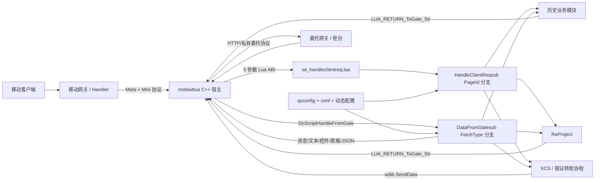

# scriptswtlua 项目业务知识与协议（AI 上下文版）

> 本文件是理解和修改 `scriptswtlua` 的首要入口。它描述当前工作区可由源码确认的业务事实；具体 PageId、FetchType、字段值、券商配置和线上开关仍以对应源码及运行时配置为准。

## 0. AI 使用说明

### 0.1 项目定位

`scriptswtlua` 是手机主站交易接入服务 `mobiwtlua` 的 Lua 业务项目。它不独立提供网络服务，而是由 `mobiwtlua` 创建 Lua VM、加载入口脚本并调用固定函数。

它承担四类核心职责：

1. 将移动客户端的页面请求按 PageId、请求类型和 CommandId 路由到具体证券业务。
2. 将客户端字段、用户会话和券商差异配置转换为柜台/委托网关请求。
3. 处理异步柜台应答，组装为客户端能识别的消息、文本、控件、表格或 JSON。
4. 以独立镜像和同步脚本更新 `mobiwtlua/project`，使 C++ 宿主和 Lua 业务可以并行发布。

### 0.2 生产基线架构事实

- 主入口是 [`deploy/wt_handleclientreq.lua`](deploy/wt_handleclientreq.lua)。
- 客户端请求入口是 `OnHandleClientReqMsg(...)`，柜台应答入口是 `DoScriptHandleFromGate(...)`。
- 请求总分发由 [`HandleClientReqsub.lua`](deploy/project/HandleClientReqsub.lua) 中的 PageId 条件链直接完成；应答总分发由 [`DataFromGatesub.lua`](deploy/project/DataFromGatesub.lua) 中的 FetchType 条件链直接完成。
- 项目同时保留历史函数式业务、ReProject 命令对象框架，以及范围较小的 CoroutineProject；生产基线中的协程业务主要是小财神聚合（PageId `26010`）和银证转账（PageId `27001-27011`）。
- 生产基线没有 `conf/coroutine_config.json`、`CoroutineConfig.lua`、`CoroutineRouter.lua` 或 `BusinessRouter/`；不能把未跟踪的迁移草稿当成线上开关或路由事实。
- `qsconfig/` 是按 QSID 选择的运行时业务适配层，尤其直接参与两融应答字段组装，不能只阅读通用实现。
- 大量 Lua 文件为 GB18030/GBK；中文注释乱码时先确认编码，不要直接按 UTF-8 重写。

### 0.3 推荐定位顺序

1. 从 PageId 或 FetchType 开始。
2. 请求查 [`HandleClientReqsub.lua`](deploy/project/HandleClientReqsub.lua) 的精确条件分支；应答查 [`DataFromGatesub.lua`](deploy/project/DataFromGatesub.lua) 的精确 FetchType 范围。
3. 判断分支进入历史 `DoSubProcessFunction_*`、ReProject `HandleClientReqsub_*`/`Interface`，还是两个生产协程入口。
4. 查业务 `*DefinesId.lua`，确认 PageId、FetchType、CommandId 和客户端字段 ID。
5. 沿请求函数的 `URL` 与 `Type` 查完整协议；全量反向索引见 [`SCRIPTSWTLUA_URL_PROTOCOL_CATALOG.md`](SCRIPTSWTLUA_URL_PROTOCOL_CATALOG.md)。
6. 沿 FetchType 找应答函数；两融等业务继续检查 `qsconfig/qs_<券商>.lua`、`getReplyTable` 和 `TableData`。
7. 最后核对运行时 JSON/文本配置、券商分支和客户端版本条件。

若问题涉及市场、账户、下单参数、聚合查询或协程恢复，先检索第 6.8-6.16 节中的函数级规则卡；规则卡给出执行顺序，源码用于确认当前配置与分支。

### 0.4 不可随意改变的不变量

- C++ 调用的两个 Lua 全局函数名、5 个入参和 3 个返回值是跨项目 ABI。
- `table.loadstring` / `table.towtstring` 的序列化字段名是 `mobiwtlua` 与本项目之间的协议。
- PageId、FetchType、CommandId、客户端字段 ID 均为跨端协议编号，只能在确认全链路兼容后修改。
- `m_nType` 的请求类型位与 CommandId 位不能互相覆盖。
- 协程请求必须透传 `CoroutineID`，否则柜台应答无法恢复挂起协程。
- 返回 userdata 时必须设置公共关联字段；返回 table 时必须能够被 `table.towtstring` 序列化。
- 券商配置默认回退、字段覆盖顺序和请求 URL 双格式不能随意简化。

## 1. 系统边界与运行拓扑



### 1.1 本项目负责什么

- 页面业务路由与交易流程编排。
- 普通账户、融资融券账户、期货账户、港美股账户等账户语义处理。
- 柜台请求参数和 URL 构造。
- 柜台结果校验、分页、字段映射和客户端视图数据组装。
- 会话缓存和跨异步请求上下文保存。
- 券商差异化配置、开关和特殊参数。
- Lua 项目镜像制作、配置拉取、脚本同步、定时更新与告警。

### 1.2 不由本项目独立决定什么

- TCP Meta/Mini 包结构和连接生命周期由 `mobiwtlua` 负责。
- 柜台接口真正的服务端校验规则由委托网关和各券商柜台负责。
- PageId 和客户端字段的最终消费语义同时受客户端版本约束。
- 生产环境配置会被启动脚本与定时任务动态刷新，仓库样例值不等于线上当前值。

## 2. 加载、入口与完整生命周期

### 2.1 模块加载

[`deploy/wt_handleclientreq.lua`](deploy/wt_handleclientreq.lua) 扩展 `package.cpath`，加载定制 `cjson`，然后按顺序加载：

- 总请求/应答分发、C/Lua 常量、通用工具、数据解析器。
- 默认及各券商配置。
- 旧业务模块：普通委托、两融、期权、国债、现金宝、港美股、期货等。
- [`ReProject/Interface.lua`](deploy/project/ReProject/Interface.lua) 及各命令域。
- [`CoroutineProject/Coroutine/ProjectInit.lua`](deploy/project/CoroutineProject/Coroutine/ProjectInit.lua)。
- Lua 覆盖率逻辑 `wtluacov.lua`，要求最后加载。

生产基线的协程初始化只加载公共工具、`UrlBuilder`、`Coroutine`、小财神模块和银证转账模块。没有通用业务路由注册器或按 JSON 加载的协程开关。

### 2.2 客户端请求生命周期

入口签名：

```lua
OnHandleClientReqMsg(nReqType, pszUserInfo, pszClientReq, pszClientHead, nExtOpt)
```

处理顺序：

1. 用 `table.loadstring` 反序列化用户、请求体和请求头。
2. 通过 `m_nSessionID` 调用 `get_userinfo(..., "UserInfo")` 恢复 Lua/C 层会话数据。
3. 登录账号变化时丢弃旧缓存，避免跨账号污染。
4. `DoSubProcessFunction` 解析 `pageid`、`requesttype`、`commandid` 和 QSID，并选择 `g_QS`。
5. 按 PageId 条件链进入历史业务；两融的特定请求可进入 ReProject，`1843/26300` 与 `26200-26499` 进入相应 ReProject 域。
6. PageId `26010` 直接进入小财神协程；`27001-27011` 进入银证转账协程。其他业务没有统一协程总路由。
7. 返回数据补充 `InstantId`、`Id`、`FrameId`。
8. table 用 `table.towtstring` 序列化；userdata 直接交给 C++。
9. 更新 session 中的 `UserInfo`，返回 `retType, retData, retErrorCode`。

### 2.3 柜台应答生命周期

入口签名：

```lua
DoScriptHandleFromGate(nReqType, pszUserInfo, pszNetFetchInfo, pszDataFromGate, nExtOpt)
```

处理顺序：

1. 反序列化 `UserInfo`、`NetFetchInfo` 和柜台应答。
2. 恢复 session 中的用户上下文。
3. 空应答被转换为超时结果，部分连续查询业务允许继续。
4. 在非黑名单 FetchType 上先尝试聚合模式 `CheckIsSupportJhMode/JhModeReturn`。
5. 按 FetchType 条件链进入历史业务或 ReProject；`26000-26999` 经 ReProject 映射，`27000-27999` 调用 `Coroutine.ReceiveOnReply`。
6. 协程应答依赖原请求写入的 `m_nCoroutineID` 恢复挂起协程；非协程应答不经过协程路由。
7. 补充请求关联字段、写回 session，并将结果返回客户端。

### 2.4 生产基线路由优先级

```text
请求：
HandleClientReqsub.lua 的 PageId 条件顺序
  -> 历史 DoSubProcessFunction_*
  -> 特定 PageId/条件进入 ReProject
  -> 26010 小财神协程
  -> 27001-27011 银证转账协程

应答：
DataFromGatesub.lua 的 FetchType 条件顺序
  -> 历史 DoSubFromGateFunction_*
  -> 26000-26999 ReProject
  -> 27000-27999 Coroutine.ReceiveOnReply
```

## 3. 核心数据对象与状态

### 3.1 `table_UserInfo`

用户会话级上下文，典型字段包括：

| 字段 | 含义 |
| --- | --- |
| `m_nSessionID` | 宿主会话标识，也是缓存关联键 |
| `m_nCurQsid` | 当前券商 ID |
| `m_nCurWtid` | 当前委托实例/通道 ID；个股期权可据此二次映射券商 |
| `m_pszLgAccount` / `m_pszLgPwd` | 普通交易登录账号/密码上下文 |
| `m_pszRZRQAccount` / `m_pszRZRQPwd` | 融资融券账户上下文 |
| `m_nLastPageID` | 客户端上一页面 |
| `pageid` / `commandid` | 请求总分发写入的当前页面和命令上下文 |

[`defines.lua`](deploy/project/defines.lua) 的 `all_userinfo` 定义 C 层可持久保存的 key，例如普通/两融账户、资金、持仓、行情、银行信息和网关应答；`all_userinfo_savelua` 定义只存在 Lua 侧的 session 数据。

### 3.2 `table_ClientHead`

| 字段 | 含义 |
| --- | --- |
| `m_sPageId` | 页面或业务动作 ID，主要请求路由键 |
| `m_nType` | 请求类型与 CommandId 的复合位域 |
| `m_nReqInstID` | 请求实例/页面实例 ID |
| `m_lId` | 请求关联 ID |
| `m_nFrameId` | 客户端 Frame ID |

### 3.3 `table_ClientReq`

客户端请求体。历史页面经常以十进制字符串形式的字段 ID 为 key，例如证券代码、价格、数量、起止日期；新协程业务也可能先把字段转换为具名属性。字段定义分散在公共 [`defines.lua`](deploy/project/defines.lua) 和业务 `*DefinesId.lua`。

生产协程创建时会写入 `asynccoroutineid`，后续柜台请求用它生成 `CoroutineID`；普通历史/ReProject 请求没有这一要求。

### 3.4 `table_NetFetchInfo`

异步请求的宿主侧关联上下文：

| 字段 | 含义 |
| --- | --- |
| `m_nFetchType` | 柜台应答类型 |
| `m_nReqCommandID` | 原始客户端命令号 |
| `m_nReqPageID` | 原始 PageId |
| `m_nReqType` | 原始请求类型 |
| `m_nReqID` | 原始请求 ID |
| `m_nReqInstID` | 原始实例 ID |
| `m_nCoroutineID` | 协程关联 ID；存在时优先恢复协程 |

### 3.5 `table_DataFromGate`

柜台返回 table。常见结果约定：

- `ret_code == "0"`：传输/网关层成功。
- `extend_return.retcode == "1"`：部分通用柜台业务层成功。
- `ret_msg`、`extend_return.retmsg`：失败提示。
- 具体业务数据字段由命令与券商接口决定，不能假设所有柜台完全一致。

## 4. 跨项目与数据协议

### 4.1 C++ ↔ Lua ABI

两个宿主入口都固定接收 5 个参数并返回 3 个值：

```text
输入：nReqType + 3 个 table 序列化字符串 + nExtOpt
输出：retType + retData(string 或 userdata) + retErrorCode
```

协议要求：

- 输入字符串必须可由 `table.loadstring` 还原。
- 普通 table 输出必须经 `table.towtstring`。
- userdata 输出必须调用 `setCommMember` 设置关联信息。
- `retType` 和 `retErrorCode` 必须是 number，入口会记录类型异常。
- Lua 全局状态随 VM 热更新丢失，跨请求持久状态应放宿主 session 或明确的 Lua session 存储。

### 4.2 `m_nType` 位域

[`defines.lua`](deploy/project/defines.lua) 定义：

```text
requesttype = m_nType & 0x00ff0000
commandid   = m_nType & 0x0000ffff
```

主要请求类型：

| 常量 | 值 | 语义 |
| --- | ---: | --- |
| `USER_REQUEST_TYPE_COMMAND` | `0x10000` | 命令 |
| `HOTKEY` / `KEYDOWN` | `0x20000` / `0x30000` | 快捷键/按键 |
| `CTRL` / `CTRLOK` | `0x40000` / `0x50000` | 控件请求/确认 |
| `REALTIME` | `0x60000` | 实时请求 |
| `MINI_LOGIN` | `0x70000` | Mini 登录 |
| `RES` / `SETVAR` / `SPECIAL` | `0x80000` / `0x90000` / `0xa0000` | 资源、变量、特殊请求 |
| `APPVER` / `TICKER` / `QUERYPASS` | `0xb0000` / `0xc0000` / `0xd0000` | 版本、行情、密码查询 |
| `STAT_INFO` / `SPEED_TEST` | `0xe0000` / `0xf0000` | 统计、测速 |
| `USER_BEHAVIOR` / `UPDATE` | `0x100000` / `0x110000` | 行为与更新 |
| `RT_CBAS` / `JSON` | `0x120000` / `0x130000` | 实时回调/JSON |

### 4.3 发往柜台的 FETCH 数据

Lua 返回 `LUA_RETURN_ToGate_Str`，或协程调用 `wtlib.SendData(sessionID, LUA_RETURN_ToGate_Str, table.towtstring(reqData))`。核心字段：

| 字段 | 必需性 | 作用 |
| --- | --- | --- |
| `URL` | 必需 | 柜台命令与参数字符串 |
| `Type` | 必需 | FetchType，用于应答分发 |
| `CommandID` | 视业务 | 保留原客户端动作 |
| `CurrencyCode` | 视业务 | 币种 |
| `PageId` | 视业务 | 页面关联 |
| `InstantId` | 通常由入口/协程补充 | 页面实例关联 |
| `Id` | 通常由入口/协程补充 | 请求关联 |
| `FrameId` | 视客户端链路 | Frame 关联 |
| `CoroutineID` | 协程必需 | 挂起协程关联 |

`URL` 同时兼容两套表达：

```text
扩展段：|key*value|key2*value2
标准段：|&key=value&key2=value2
```

很多请求会同时写扩展段与标准段，例如 `|cmd*xxx|...|&cmd=cmd_generic_dt&...`。[`UrlBuilder.lua`](deploy/project/CoroutineProject/UrlBuilder/UrlBuilder.lua) 按 `extend`、`standard` 顺序拼装；`NOKEY` 表示直接插入一段已有参数。参数来源可以是默认值、用户/客户端 table 字段或函数计算值。

### 4.4 柜台应答关联协议

宿主在异步返回时把原请求上下文恢复到 `table_NetFetchInfo`：

- 旧链路主要依赖 `m_nFetchType` 进入范围分发。
- ReProject 依赖 FetchType 找命令对象，并可能恢复缓存后继续 `CallFunction`。
- 协程链路优先依赖 `m_nCoroutineID` 找到 `asyncCoroutines[id]`，将 `netFetchInfo, dataFromGate` 作为 `coroutine.resume` 参数。

因此 FetchType 与 CoroutineID 分工不同：FetchType描述业务应答类型，CoroutineID描述某一次挂起的执行上下文。

### 4.5 Lua 返回类型

[`c_lua_defines.lua`](deploy/project/c_lua_defines.lua) 定义：

| 值 | 常量 | 目的地/语义 |
| ---: | --- | --- |
| 1 | `LUA_RETURN_ToGate_Str` | 发往委托网关 |
| 2 | `LUA_RETURN_ToThirdParty_Str` | 发往第三方 |
| 3 | `LUA_RETURN_Wtlog` | 日志 |
| 4 | `LUA_RETURN_DoNothing` | 不立即回客户端；协程挂起时使用 |
| 11 | `LUA_RETURN_ToClient_Msg` | 客户端消息提示 |
| 13 | `LUA_RETURN_ToClient_Text` | 文本页 |
| 14 | `LUA_RETURN_ToClient_Ctrl` | 控件 |
| 15 | `LUA_RETURN_ToClient_Table` | 表格 |
| 16 | `LUA_RETURN_ToClient_GotoPage` | 跳转页面 |
| 17 | `LUA_RETURN_ToClient_JSON` | JSON |

典型客户端数据结构：

- 消息：`PageId`、`File`、`Msg`、`TipId`、`MsgFlag`。
- 文本：`Title`、`Content`。
- JSON：`PageId`、`JsonLen`、`JsonBuf`。
- 控件/表格：`Type` 加字段 ID、行列、翻页标志等节点数据。
- 所有异步响应都应保持 `InstantId`、`Id`、`FrameId` 等关联字段一致。

### 4.6 客户端节点与回复位域

公共常量定义了：

- `REPLY_DATA_TYPE_FILE/TEXT/MENU/CTRL/...`：展示数据类型。
- `REPLY_DATA_SAVE_SESSION/REALTIME/DISK`：缓存策略。
- `REPLY_TABLE_HAS_PREV_DATA/HAS_NEXT_DATA/ROW_ALIGN_BOTTOMUP`：表格翻页和方向。
- `CLIENT_NODE_TYPE_OBJECT_*`、`CLIENT_NODE_TYPE_VIEW_*`、`CLIENT_NODE_CTRL_TYPE_*`：客户端节点、视图和控件类型。

这些值属于客户端展示协议。重用旧字段 ID 或更改组合位会导致数据被错误控件消费。

### 4.7 协议编号命名空间

代码中协议编号数量很大，AI 应先按前缀判断它在链路中的角色，再去对应业务 Defines 文件读取精确值：

| 命名空间 | 角色 | 典型定义位置 | 修改约束 |
| --- | --- | --- | --- |
| `EQ_VIEW_*` | 客户端 PageId/业务动作 | 各业务 `*DefinesId.lua` | 与客户端页面及路由同步，只追加不复用旧语义 |
| `NET_FETCH_TYPE_*` / `NET_FETCH_*` | 发柜台请求的 Type、回包分发键 | 各业务 Defines、ReProject/Coroutine Defines | 请求构造与应答处理必须成对存在 |
| `WT_ID_*` | 客户端请求/展示字段 ID | 公共 `defines.lua` 与业务 Defines | 与客户端控件/表格字段同步，不可按局部变量理解 |
| `USER_REQUEST_TYPE_*` | `m_nType` 高位请求动作 | `defines.lua` | 必须保持位掩码兼容 |
| `LUA_RETURN_*` | Lua 到宿主的处理结果 | `c_lua_defines.lua` | 属于 C/Lua ABI |
| `CLIENT_NODE_*` / `REPLY_DATA_*` | 客户端节点、视图、缓存和回复标志 | `defines.lua` | 位域组合协议，不能随意重排 |
| `QSID_*`、`MARKET_*`、币种常量 | 券商、市场和账户路由 | `qsconfig/qs_defines.lua`、公共/业务 Defines | 需结合券商配置和柜台市场代码 |
| `_ERR_*`、`MSG_ID_*` | 日志告警或客户端提示编号 | `defines.lua` 与业务 Defines | 不要把日志错误码与柜台 `ret_code` 混用 |

精确排查规则：从一个 `EQ_VIEW_*` 沿 PageId 路由找到请求函数，再记录其 `NET_FETCH_TYPE_*`，最后沿 FetchType/CoroutineID 找应答函数和输出 `WT_ID_*`。这条链路才构成一个完整业务协议，单独看到任一常量不足以判断行为。

## 5. 请求与应答路由分区

### 5.1 PageId 业务分区

当前总范围以生产基线 [`HandleClientReqsub.lua`](deploy/project/HandleClientReqsub.lua) 的条件顺序为准：

| PageId | 业务域 |
| --- | --- |
| 普通交易页（一般 `<= 3000`，特殊范围优先） | A 股普通委托 |
| `1951-2020`、`2100-2101`、`2602`、`2650`、`20110-20199`、`4602-4605` | 融资融券历史业务 |
| `20050-20109` | 新三板 |
| `20200-20299` | 现金宝历史业务 |
| `21499-21599` | 小财神 |
| `22000-22049`、`23000-23999` | 港美股 |
| `22050-22099` | 个股期权 |
| `22100-22149` | 国债 |
| `22150-22199` | 基金 |
| `22200-22249` | 风险测评 |
| `22250-22299` | 债转股 |
| `22400-22419` | 条件单透传 |
| `22421-22439` | ReProject 普通委托/可买查询 |
| `2502-2510`、`22500-22599` | 新股申购历史域 |
| `22600-22699` | 创业板转签 |
| `22800-22899` | CTP 期货 |
| `22910-22979` | 科创板 |
| `25000-25099` | 单点登录 |
| `25100-25199` | 一键清仓 |
| `25200-25299` | 特殊请求历史域 |
| `25300-25349` | 快速柜台 |
| `26200-26298` | 两融改单 |
| `26299`、`26300` | ReProject 特殊请求 |
| `26301-26399` | ReProject 新股申购 |
| `26401-26499` | ReProject 两融 |
| `27001-27011` | 普通/两融银证转账协程域 |

PageId 范围只是快速导航，必须以条件分支、业务 Defines 和请求函数共同确认；前面的特殊范围优先于最后的普通交易 `<= 3000` 兜底。

### 5.2 FetchType 旧链路分区

生产基线 [`DataFromGatesub.lua`](deploy/project/DataFromGatesub.lua) 直接使用：

| FetchType | 业务域 |
| --- | --- |
| `10000-10099` | 新股申购 |
| `10100-10299` | 融资融券 |
| `10300-10399` | 新三板 |
| `10400-10499` | 小财神 |
| `10500-10599` | 国债 |
| `10600-10699` | 个股期权 |
| `10700-10799` | 风险测评 |
| `10800-10899` | 创业板转签 |
| `10900-10999` | 现金宝 |
| `11300-11999` | A 股普通委托 |
| `18000-18999` | 港美股 |
| `20000-20999` | CTP 期货 |
| `21000-21999` | 单点登录 |
| `22000-22049` | 一键清仓 |
| `22050-22099` | 特殊请求历史域 |
| `22100-22149` | 快速柜台 |
| `23000-23999` | 科创板 |
| `26000-26999` | ReProject |
| `27000-27999` | 生产协程应答（小财神聚合、银证转账） |

`DataFromGatesub.lua` 只有进入 `27000-27999` 分支后才调用 `Coroutine.ReceiveOnReply`；不存在范围分发之前的全局协程恢复逻辑。

## 6. 全业务域说明

### 6.0 公共支撑模块

这些目录不是独立交易业务，但会影响所有业务的数据和协议行为：

| 目录 | 职责 |
| --- | --- |
| `deploy/project/common/` | 日期、文件、字符串、table 等历史通用工具 |
| `deploy/project/dataParser/` | `NumberFormat`、`TableData`、`ExtraData`、`CtrlData`，负责客户端表格/扩展数据/控件数据组装 |
| `deploy/project/qs_config.lua` | QSID 与券商中文名称表；它不是应答字段配置主体 |
| `deploy/project/qsconfig/` | 券商运行时业务适配层：除开关和参数外，还定义两融等业务的应答字段 Schema、字段回退、计算列、颜色、显隐、过滤和排序规则 |
| `deploy/project/conf/` | 新股、交易、节假日、日志等文件配置；生产基线无协程开关 JSON |
| `CoroutineProject/Common/` | 生产协程使用的日志和普通/两融账户辅助函数 |
| `CoroutineProject/Utils/` | 生产协程使用的时间与 table 工具 |
| `CoroutineProject/UrlBuilder/` | 银证转账/小财神使用的声明式 URL 参数协议与命令模板 |

### 6.1 业务总表

| 业务 | 生产实现目录/框架 | 主要能力 |
| --- | --- | --- |
| A 股普通委托 | `WeiTuo/`（历史函数式） | 买卖、可买可卖、资金持仓、委托成交、撤单、行情联动 |
| ReProject 普通委托 | `ReProject/CmdProcess/WeiTuo/` | 普通与港股通可买数量查询、链式命令 |
| 融资融券 | `RongZiRongQuan/` + `ReProject/CmdProcess/RongZiRongQuan/` | 融资买入、融券卖出、还款还券、担保品、负债与委托查询 |
| 两融改单 | `ReProject/CmdProcess/Margin/` | 可撤委托、撤单、改单委托、成交/委托记录 |
| 新股申购 | `XinGuShenGou/` + `ReProject/CmdProcess/IPO/` | 额度、信息、行情、中签、历史中签、普通/两融申购 |
| 新三板 | `XinSanBan/` | 新三板行情、查询和交易 |
| 港美股 | `GangMeiGu/` | 港/美股交易查询、撤改、IPO、出入金、换汇、认证授权 |
| 港股通价差 | `ReProject/CmdProcess/GangGuTong/` | 港股通价差/补偿相关查询 |
| 个股期权 | `GeGuQiQuan/` | 查询、交易、转账、持仓合约 |
| CTP 期货 | `CTP/` | 下单撤单、持仓成交、资金、银期转账、结算单、模拟交易 |
| 科创板 | `KeChuangBan/` | 科创板交易、盘后相关查询和委托 |
| 基金 | `ReProject/CmdProcess/JiJin/` | 基金信息、认购、当日/历史委托成交、撤单 |
| 债转股 | `ReProject/CmdProcess/ZhaiZhuanGu/` | 业务类型、证券信息、可用数量、行情、转股/回售委托 |
| 国债 | `GuoZhai/` | 国债业务查询与交易 |
| 条件单 | `ReProject/CmdProcess/Tjd/` | 条件单透传及通用命令执行 |
| 现金宝 | `XianJinBao/` | 现金管理产品查询、申赎/转入转出及券商差异 |
| 银证转账 | `CoroutineProject/FundTransferService/` | 普通/两融银行、余额、转入转出、流水、两融可取资金 |
| 小财神 | `XiaoCaiShen/` + `CoroutineProject/XiaoCaiShen/` | 历史业务与 PageId `26010` 聚合协程 |
| 风险测评 | `FengXianCePing/` | 问卷、答案提交、状态、协议、权限和适当性流程 |
| 创业板转签 | `ChuangYeBanZhuanQian/` | 转签状态、开通/取消、短信与协议流程 |
| 一键清仓 | `YiJianQingCang/` | 持仓查询、批量卖出、撤改与结果聚合 |
| 单点登录 | `SingleSignOn/` | SSO 请求和应答 |
| 特殊请求 | `SpecialRequest/` + `ReProject/CmdProcess/SpecialRequest/` | 用户信息查询、签约及历史特殊接口 |
| 快速柜台 | `QuickCounter/` | HXOEMS/快速柜台扩展透传 |

### 6.2 A 股普通委托

历史入口 [`HandleClientReqsubFromWeiTuo.lua`](deploy/project/WeiTuo/HandleClientReqsubFromWeiTuo.lua) 通过 PageId、CommandId、请求类型找到 `WeiTuoBasePage` 子类。主要流程包括：

- 买入/卖出页面初始化、行情和可买可卖查询。
- 交易确认与委托提交。
- 当日/历史委托、当日/历史成交、可撤委托和撤单。
- 资金、股份、市场和股东账号选择。

PageId `22421-22439` 由 `HandleClientReqsub_Weituo` 进入 ReProject 普通/港股通可买查询；它不是完整普通委托域，也不是协程包装。

### 6.3 融资融券与两融改单

融资融券存在两类并存链路：

1. `RongZiRongQuan/`：覆盖完整老两融业务。
2. `ReProject/CmdProcess/RongZiRongQuan/`：统一命令对象，聚焦担保品划转、直接还券、可委托数量等。

`ReProject/CmdProcess/Margin/` 独立处理两融改单、可撤委托、撤单、成交和委托记录。修改时必须确认账户类型、市场、负债/担保品语义及券商对通用命令的差异。

### 6.4 新股申购

普通账户与两融账户各有额度、证券信息、行情、中签、历史中签和申购命令。部分页面会先查询证券/行情，再通过 `CallFunction` 或协程继续申购。

相关动态配置：

- [`xin_gu_code_rule.json`](deploy/project/conf/xin_gu_code_rule.json)：新股代码规则。
- [`xgsg_prompt.json`](deploy/project/conf/xgsg_prompt.json)：客户端提示配置。
- [`GetXinGuCalendar.sh`](deploy/scripts/GetXinGuCalendar.sh)：刷新申购日历。

### 6.5 港美股、港股通、期权与期货

- 港美股包含港股/美股委托查询、撤改、分笔成交、资金流水、IPO、出入金、货币兑换、二次认证和交易授权，均从历史 `GangMeiGu/` 路由。
- 港股通 GGT 的价差等业务由 ReProject 命令对象处理。
- 个股期权按查询、交易、转账、持仓合约拆分；`qsid == 799` 时会用 `m_nCurWtid` 映射实际券商配置。
- CTP 覆盖期货下单撤单、成交持仓、资金、密码、银期转账、结算单、手续费/限制以及模拟交易等较大业务面。

### 6.6 资产管理与辅助交易

- 现金宝在 `XianJinBao/` 的 QSID 分支和券商专属文件中选择不同协议实现；生产基线没有统一 `XianJinBaoBrokerAdapter`。
- 小财神把普通/两融资金、持仓、成交和流水进行多请求聚合；需关注跨请求缓存、分页和上传步骤。
- 基金、债转股和国债分别处理基金交易、转股/回售和国债业务。
- 一键清仓是多步骤批量交易流程，不能将单笔失败简单等同于整个流程失败。

### 6.7 准入、权限与平台辅助

- 风险测评包含问卷、状态、答案、协议、权限与适当性留痕。
- 创业板转签包含资格/状态查询、短信验证、协议与开通取消。
- SSO 负责单点登录链路。
- SpecialRequest 同时有历史范围和 ReProject 的用户信息/签约命令。
- QuickCounter 以 `reqextend` 等字段把请求透传到快速柜台。

### 6.8 函数级业务规则的阅读格式

本节开始记录“条件判断顺序会改变业务结果”的源码规则。AI 回答具体业务问题时，应优先引用这里的规则卡，再回到链接源码确认券商配置和当前分支。规则卡字段约定如下：

| 字段 | 含义 |
| --- | --- |
| 入口 | 实际执行规则的函数或 Service |
| 前置条件 | 不满足时直接返回、报错或回退的条件 |
| 判定顺序 | 源码真实的先后次序；后项只在前项未命中时执行 |
| 输出/副作用 | 返回值、缓存、日志、发柜台请求或客户端响应 |
| 兼容与风险 | 历史数据结构、券商配置、错误分支和不可随意合并的逻辑 |

不要只凭函数名推断规则。例如“获取市场”可能按代码段、正则特征、股票类型、市场代码、市场名称依次回退；改变顺序会选中不同股东账户。

### 6.9 市场、代码段和股东账户规则

#### 6.9.1 `isBJSCode`：北交所代码段不是硬编码

入口：[`common/common.lua::isBJSCode`](deploy/project/common/common.lua)。

执行顺序：

1. 把 `code` 转为数字；无法转换时变为 `0`。
2. `ywType` 未传时默认使用 `"GpCode"`。
3. 通过 `wtlib.GetJsonConfig("BJSCfg")` 读取运行时 JSON，而不是在函数中写死 43、83、87 等号段。
4. JSON 不存在时返回 `false`；代码为 `0` 或 JSON 解码结果不是 table 时也返回 `false`。
5. 遍历 `BJSCfg[ywType]`，只要满足 `Start <= code <= End` 就返回 `true`；全部不命中才返回 `false`。

因此，判断某证券是否属于北交所时，必须同时查看部署时注入的 `BJSCfg`。不能仅根据当前常见号段在代码中复制一套判断。

#### 6.9.2 `GetBjsMarket`：北交所市场索引的完整决策链

入口：[`comm.lua::GetBjsMarket`](deploy/project/comm.lua)，主要调用方在历史两融交易、担保品划转和 ReProject 两融命令中。

输入：

- `tb_MarketList`：账户市场列表；返回的是该列表中的 Lua 下标，不是市场对象或市场代码。
- `zrlx`：转让类型；只有 `"B"` 才表示北交所股票。
- `zqdm`：证券代码。

严格判定顺序：

1. 先调用 `isBJSCode(zqdm, "GpCode")` 判断代码是否落在运行时北交所代码段。
2. 若 `zqdm == nil`，或没有同时满足“北交所代码且 `zrlx == "B"`”，立即返回 `nil`。
3. 若代码确实是北交所代码但 `zrlx ~= "B"`，额外写 warning 日志，错误码为 `_ERR_BJS_ZRLX_INVALID`；该分支仍返回 `nil`。
4. 前置条件通过后，遍历每个市场的 `m_pPatternList`，取 `m_pszNormalized`，先去掉左右括号，再用 `IsMatched(zqdm, pattern, "|")` 匹配证券代码。
5. 特征码命中后还不能直接返回：市场代码必须是普通北交所 `MARKET_BJ_A`（值为 `":"`）或两融北交所 `MARKET_RZRQ_BJ_A`（值为 `"!:"`；源码此处直接比较字面量）才返回当前下标。
6. 所有特征码/市场代码组合都未命中时，才按市场名称回退：名称优先取 `m_pszMarketName`，否则取历史结构 `item.D_2171`；名称必须同时匹配 `"北:京"` 和 `"A"`。
7. 名称仍不匹配时返回 `nil`。

等价伪代码：

```lua
if not isBJSCode(zqdm, "GpCode") or zrlx ~= "B" then
    -- 北交代码 + 非 B 还要记 _ERR_BJS_ZRLX_INVALID
    return nil
end

for market in marketList do
    if stockCodeMatchesPattern(market) and
       (market.code == ":" or market.code == "!:") then
        return market.index
    end
end

for market in marketList do
    if market.name contains (北 or 京) and market.name contains A then
        return market.index
    end
end
return nil
```

兼容风险：

- 不能把第 5 步的市场代码校验删掉，否则相同证券特征可能误命中普通深沪或其他市场。
- 不能把市场名称回退提前，否则会绕开精确的代码特征和 `":"`/`"!:"` 区分。
- `table.getn(tb_MarketList)` 在类型检查之前执行，调用方应保证传入 table；函数自身只在内部特征码循环处再次检查类型。
- 历史调用方拿到 `nil` 后通常还会继续调用 `GetMarketByStockType`，所以 `nil` 表示“本规则未选出北交市场”，不总是终止整笔业务。

#### 6.9.3 普通市场匹配：特征优先于传统字符串

入口：[`comm.lua::GetMarketByStockCode`](deploy/project/comm.lua)、`Get3BanMarketByStockCode`、`GetMarketByStockType`，以及 [`WeiTuoBasePage.lua::getMarketInfoByType`](deploy/project/WeiTuo/WeiTuoBasePage.lua)。

`GetMarketByStockCode` 的顺序：

1. 先交给 `Get3BanMarketByStockCode` 按 `m_pPatternList[].m_pszNormalized` 匹配。
2. 特征匹配时排除空市场代码、深 A、沪 A、沪港通、深港通；因此它用于优先识别三板/北交等非主流市场。
3. 未命中时才遍历历史字段 `item.D_2170`，用通配字符串匹配证券代码。

`GetMarketByStockType` 的规则：

- 股票类型首位 `1` 对应上海/沪，首位 `2` 对应深圳。
- 类型第二位为 `2` 时匹配 B 股字符集合 `Ｂ/ｂ/B/b`，否则匹配 A 股字符集合。
- 无法从类型得到深沪方向时，回退为第一个名称既不含上海/沪、也不含深圳的市场。

`WeiTuoBasePage:getMarketInfoByType` 的顺序与旧函数不同，必须单独记忆：

1. `stockCode == nil` 直接返回 `nil`。
2. 港股代码优先：默认沪港通；`stockType` 明确是沪港通或深港通时服从传入类型。
3. 非港股先按市场正则特征匹配。
4. 再按 `stockType` 推导市场代码并查市场列表。
5. 最后仅用证券代码前两位兜底：`00`/`30` -> 深 A，`60` -> 沪 A。

#### 6.9.4 市场代码/名称互转和两融结构兼容

入口：[`comm.lua`](deploy/project/comm.lua) 中 `getRzrqMkCode`、`getRzrqMkName`、`getRzrqScdmByScmc`、`getRzrqScdm`、`rzrqGetPtScdm`。

- `getRzrqMkCode(item, scdmKey, scmcKey)`：字段中已有市场代码时直接返回；仅在代码字段不存在时才按市场名称查两融账户列表；两者都无则空串。
- `getRzrqMkName(item, scmcKey, scdmKey)`：市场名称优先，缺失时才按代码映射。已知映射包括普通/两融深 A、普通/两融沪 A以及 `":" -> 北京A股`。
- `getRzrqScdmByScmc`：只接受市场名称完全相等的两融账户记录，并明确排除普通市场代码 `"1"` 和 `"2"`。
- `getRzrqScdm`：先按股票类型选市场；若证券是北交所代码，无条件把结果覆盖为两融北交代码 `"!:"`。
- `rzrqGetPtScdm`：先按登录模式读取不同结构；北交所代码先尝试普通北交代码 `":"`，若该代码不存在于当前账户市场列表，则回退三板 A `"6"`。

两融登录模式的数据结构差异：

| `loginMode` | 市场代码字段 | 账户列表结构 |
| --- | --- | --- |
| `1`（一次登录） | `item.D_2167` | 每条市场记录自身含 `item.D_2106`、`item.D_2176` |
| `2`（二次登录） | `m_pMarketCode` | `m_pAccountList[]`，账户为 `m_pszAccount`、主账户标志为 `m_bMaster` |

#### 6.9.5 股东账户选择：主账户优先，第一个兜底

入口：`getGdzhByScdm`、`rzrqGetPtGdzhByScdm`、[`WeiTuoBasePage.lua::getMasterAccount`](deploy/project/WeiTuo/WeiTuoBasePage.lua)。

共同规则都是“先找主账户，没有主账户才用第一个账户”，但字段随数据结构变化：

- 历史两融结构：市场代码 `D_2167` 相等；`D_2176 == "1"` 为主账户；账号在 `D_2106`。
- 新市场结构：`m_pMarketCode` 相等；`m_bMaster == "1"` 为主账户；账号在 `m_pszAccount`。
- `WeiTuoBasePage:getMasterAccount` 接受单个市场对象，只扫描它的 `m_pAccountList`。

任何重构都应保留“主账户覆盖先前兜底账户”的顺序，否则多股东账户用户会下到错误账号。

### 6.10 普通委托的关键决策链

#### 6.10.1 `directTradeRequest`：下单参数来源优先级

入口：[`WeiTuoBasePage.lua::directTradeRequest`](deploy/project/WeiTuo/WeiTuoBasePage.lua)。

执行顺序：

1. 买入读取 `m_tradeBuyInfo`、数量字段 `WT_ID_BUY_COUNT`、命令 `cmd_wt_mairu`；卖出读取 `m_tradeSaleInfo`、`WT_ID_SALE_COUNT`、命令 `cmd_wt_maichu`。
2. 港股代码先标准化：`HKxxxx` 转成五位 `0xxxx`。
3. 市场代码优先取客户端 `WT_ID_SCDM`。
4. 若为港股，市场代码被交易类型覆盖：`shengangtong` -> 深港通 `"9"`，`hugangtong` -> 沪港通 `"8"`，未明确时默认沪港通。
5. 非港股且客户端未送市场代码时，才用 `stockType + stockCode` 调 `getMarketInfoByType` 推导。
6. 仍没有市场代码时，返回 `ERR_TRADE_NO_SCDM`，不发送柜台请求。
7. 委托策略优先取客户端 `WT_ID_WEITUO_POLICY`，缺失时取先前行情/页面缓存中的 `tradeInfo.policy`。
8. 股东账号优先取客户端 `WT_MULT_GDZH`；空串时按市场代码找市场，再选主账户/首账户。
9. 港股通卖出若数量小于每手股数或不能整除每手股数，追加碎股参数 `msgs*<每手股数>|wtcl*B`。
10. 科创板委托追加 `type*kcbwt_ph`；券商开关允许时追加客户端批次 `wtpch`；请求来源、快速风控、风险确认字段只在非空时追加。
11. 北交所代码只有在 `zrlx == "B"` 时追加 `gzxt*2|sblx*0`。
12. 同一请求同时构造竖线参数和 `&cmd=...&mkcode=...` URL 参数，两种格式都属于柜台兼容协议，不得只保留一种。
13. 最后把交易参数保存到买入/卖出缓存，并以客户端请求 ID 缓存本次直接交易信息，供后续应答/重试关联。

#### 6.10.2 港股代码与能力判断

入口：`WeiTuoBasePage:isHKStock`、`transTradeHKStockCode`、`formatStockCode`、`isSupportHGT`、`isSupportSGT`、`isSupportGGT`。

- 港股识别只接受两种形式：5 位且首位是 `0`，或 6 位且前缀为 `HK`。
- 发交易时 `HKxxxx` 转为 `0xxxx`；给客户端展示时五位港股转为 `HK` 加后四位。
- 是否支持沪港通/深港通不是券商 ID 硬编码，而是看当前 `m_pMarketList` 是否存在市场代码 `"8"`/`"9"`。
- “支持港股通”是两者任一存在。

#### 6.10.3 价格精度规则

入口：[`comm.lua::check_stock`](deploy/project/comm.lua)、`calcRzrqPricePrecisionBystock`。

`check_stock` 的优先级：

1. 配股标志开启且为配股代码 -> `"--"`。
2. 值为空或数值为 0 -> `"--"`。
3. 北交所代码 -> 固定 2 位小数。
4. 股票代码为空 -> 3 位小数。
5. 交易所 `19`：若精度开关为 `enable` 则 3 位；否则 110/111/113/118 开头为 2 位，其他为 3 位。
6. 交易所 `35` -> 3 位。
7. 其余再按证券代码前 1/2/3 位的大列表决定 2 位或 3 位。

此函数既包含市场规则又包含券商开关，不能用统一 `string.format("%.2f")` 替代。

#### 6.10.4 可转债单位和步长

入口：`WeiTuoBasePage:isKZZCode`、`isKzzStock`、`getKZZUnit`、`getKzzUnitNotGz`、`getJydwByUnit`。

- 可转债识别有两套配置：通用查询先查 `GuoZhai.StockCode` 精确表，再查 `GuoZhai.Feature` 特征；普通下单使用 `KzzCfg.Feature`。
- `getKZZUnit` 先读 `GuoZhai.<qsId>`，不存在再回退 `GuoZhai.Default`；按股票类型首位分别读取 `SH_Unit`/`SZ_Unit`。
- 配置值 `gu`/`zhang`/`shou` 分别映射股/张/手。
- 步长规则：张 -> 10，手 -> 1，份 -> 100，其他默认 100。
- 非国债路径仍有代码和股票类型判断；债券在特定券商开关开启且最小交易单位为 100 时可显示“手”，否则显示“张”。

### 6.11 融资融券详细规则

#### 6.11.1 历史两融下单的市场回退

入口：[`RongZiRongQuan/wt_rzrq_func.lua::directTradeRequest`](deploy/project/RongZiRongQuan/wt_rzrq_func.lua)。

客户端未送市场代码时：

1. 先看客户端是否送市场名称。
2. 市场名称也为空时，从会话读取 `m_pRZRQAccountInfo`。
3. 先调用 `GetBjsMarket(MarketInfo, zrlx, zqdm)`。
4. 北交规则没选出下标时，再调用 `GetMarketByStockType(MarketInfo, stType)`。
5. 客户端送了市场名称时，不走以上代码/类型判断，而是 `getRzrqScdmByScmc(scmc)`。
6. 股东账号未送时再按最终市场代码调用 `getGdzhByScdm`。

这解释了为什么 `GetBjsMarket` 的结果只对北交路径优先，而不是替代所有市场选择。

#### 6.11.2 普通与两融北交市场代码不能混用

| 语义 | 常量 | 值 |
| --- | --- | --- |
| 普通北交所 | `MARKET_BJ_A` | `":"` |
| 两融北交所 | `MARKET_RZRQ_BJ_A` | `"!:"` |
| 三板 A 兼容回退 | `MARKET_SB_A` | `"6"` |

行情、普通账号和两融账号可能返回不同市场代码。业务函数必须根据账户域选择；不能因为都叫“北京 A 股”就统一替换为 `":"`。

#### 6.11.3 两融历史域与 ReProject 边界

- `RongZiRongQuan/` 是完整历史两融域，覆盖常规查询、交易、担保品和负债处理。
- `isRzRqReprojectRequest` 目前只在 PageId `1961`、请求类型为 `CTRL` 且 QSID 命中 `tradewtDbpQueryWtsl` 配置时切到 ReProject。
- `ReProject/CmdProcess/RongZiRongQuan/` 承接 `26401-26499` 及上述特定担保品查询；`ReProject/CmdProcess/Margin/` 承接 `26200-26298` 的改单域。

判断一笔两融请求归属时，以 `HandleClientReqsub.lua` 的条件顺序、`isRzRqReprojectRequest` 和 ReProject 的 PageId 映射为准。生产基线没有两融协程总路由。

#### 6.11.4 `qs_config.lua` 与 `qsconfig/` 的职责不能混淆

项目中有两个名字接近、职责不同的入口：

| 位置 | 实际职责 |
| --- | --- |
| [`qs_config.lua`](deploy/project/qs_config.lua) | 定义 `qsName`，把 QSID 映射为券商中文名称；不负责两融表格字段组装 |
| [`qsconfig/qs_defines.lua`](deploy/project/qsconfig/qs_defines.lua) | 加载 90 余个公共/券商 Lua 模块，建立 `g_QsMap["qs" .. qsid] -> 券商配置对象` |
| [`qsconfig/qs_common.lua`](deploy/project/qsconfig/qs_common.lua) | 公共历史配置和完整的默认两融字段表 |
| [`qsconfig/qs_mini.lua`](deploy/project/qsconfig/qs_mini.lua) | 未识别券商及许多字段表缺失时的兼容兜底；包含多字段候选和统一客户端字段 ID |
| [`qsconfig/qs_standard.lua`](deploy/project/qsconfig/qs_standard.lua) | 柜台接口已标准化时使用的统一两融应答 Schema |
| `qsconfig/qs_<broker>.lua` | 券商专属覆盖：登录模式、请求参数、功能开关、源字段、计算规则和展示 Schema |

Lua 总入口的加载顺序是 `qs_mini.lua -> qs_config.lua -> qs_defines.lua`。`qs_defines.lua` 再加载各券商文件，最后创建 `g_QsMap`；所以券商文件可以引用先加载的公共解析函数和配置对象。

#### 6.11.5 `g_QS`：每次请求和每次应答都会重新选择券商适配器

入口：[`HandleClientReqsub.lua::DoSubProcessFunction`](deploy/project/HandleClientReqsub.lua) 与 [`DataFromGatesub.lua::DoSubFromGateFunction`](deploy/project/DataFromGatesub.lua)。

严格选择顺序：

1. 从 `table_UserInfo.m_nCurQsid` 取得 QSID。
2. 个股期权的 QSID 为 `"799"` 时，不能直接查配置；先用 `m_nCurWtid` 经 `g_ggqqWeiTuoIdMap` 映射到实际券商 QSID。
3. 使用 `g_QsMap["qs" .. (qsid or "Default")]` 选择配置。
4. 未识别的非空 QSID 回退 `qs_mini`；QSID 缺失时键为 `qsDefault`，在 `g_QsMap` 中对应 `qs_common`。
5. 民生证券还会根据运行时开关 `loginModeChange` 把 `g_QS.rzrq.loginMode` 动态改成 `2` 或 `1`。
6. 柜台应答入口重复执行同一套 QSID/WTID 选择，然后才进入 FetchType 对应的应答处理。

应答侧重新选择 `g_QS` 很关键：异步回包不能依赖另一次请求遗留的全局 `g_QS`。分析任何两融回包时，必须把 `table_UserInfo.m_nCurQsid` 作为字段组装的输入之一。

#### 6.11.6 `getReplyTable`：两融应答 Schema 的三级优先级

入口：[`wt_rzrq_func.lua::getReplyTable`](deploy/project/RongZiRongQuan/wt_rzrq_func.lua)。

```text
if g_QS.rzrq.SpecialQsCof == 1:
    券商专属表 -> qs_standard 同名表
elseif RzrqUseStandardTable[qsid] == USESTANDARDTABLE:
    强制 qs_standard 同名表
else:
    券商专属表 -> qs_mini 同名表
```

含义：

- `SpecialQsCof == 1` 表示接口总体已标准化，但该券商仍有较大的显示差异；有专属表就覆盖，没有才退到标准表。
- `RzrqUseStandardTable` 是 QSID 白名单；命中后即使券商文件存在旧字段表，也直接使用 `qs_standard`。
- 非标准化券商优先使用自己的 `g_QS.rzrq[tableName]`，缺少该表时才使用 `qs_mini`。
- 部分旧应答函数没有调用 `getReplyTable`，而是直接采用 `g_QS.rzrq.<reply> or qs_mini.rzrq.<reply>`；排查时必须以调用点为准，不能假定所有表都走标准化白名单。

典型表名包括 `zcfzReply`、`xyzjgpReply`、`querydbpReply`、`krqReply`、`rqhzReply`、`queryFinancingDebtCollectionReply`、`rzwchmxReply`、`rzychmxReply`、`rqwchmxReply`、`rqychmxReply`、`dbphzReply`、`drzzjlReply`、当日/历史委托成交表等。

#### 6.11.7 一条应答字段配置如何变成客户端表格

字段常量定义于 `defines.lua`：`C_NAME = 1`、`C_FROM = 2`、`C_TO = 3`。单列配置的通用结构为：

```lua
{
    "客户端列标题",                  -- C_NAME
    "D_源字段" / {候选字段...} / 函数, -- C_FROM
    "D_目标字段或统一字段ID",          -- C_TO，可省略
    行颜色函数,                        -- 第4位，可省略
    showCol = 列显隐函数                -- 可省略
}
```

取值规则由 [`common/common.lua::GetValueByKey`](deploy/project/common/common.lua) 决定：

1. `C_FROM` 是字符串：读取 `item[key]`，缺失返回空串。
2. `C_FROM` 是函数：执行函数完成计算、格式化或跨字段转换。
3. `C_FROM` 是 table：按声明顺序取第一个非空候选值；例如 `{"D_4006", "D_2116"}` 表示优先新字段、再兼容旧字段。
4. 客户端列 ID由 `C_TO or C_FROM` 决定；因此券商可以读取自己的柜台字段，却统一输出客户端约定字段。

[`TableData.lua::getPagedData`](deploy/project/dataParser/TableData.lua) 的处理顺序：

1. 若柜台带 `head`，先用 `showCol` 或 `C_FROM` 候选检查真实存在的列；没有 `head` 时复制整个 reply Schema。
2. 执行 `getSkip`/外部 `setSkipFunction` 过滤记录，并重算记录数。
3. 执行 `getSort`/`setSortFunction` 排序。
4. 根据 `startRow`、`rowCount` 分页；`rowCount == 0` 表示返回全部。
5. 生成 `ColNames` 和 `FieldTitles`。
6. 对每一行、每一列调用 `GetValueByKey`；行颜色来自 reply 的 `getColor`，专属调用点也可覆盖颜色函数。
7. 追加滚动位置、总记录数和隐藏字段等 ExtraData。

因此 `qsconfig` 不是被动常量表，而是实际参与执行的数据转换程序。字段顺序、候选字段顺序、`C_TO`、解析函数或 `showCol` 的变化都会改变客户端协议结果。

#### 6.11.8 资产负债应答：标准表与券商表的关键差异

入口：`RZRQQueryzcfzReplyFromGate` 及 `g_QS.rzrq.zcfzReply`。

标准化路径把客户端字段按模块固定到统一编号段，每个模块预留 15 个 ID，例如：

- `3601-3615`：账号/担保比例/可用金额等。
- `3616-3630`：净资产。
- `3631-3645`：总资产及构成。
- `3646-3660`：总负债及构成。
- `3661-3675`：盈亏。
- `3676-3690`：已用保证金。
- `3691-3705`：授信额度。

维持担保比例不能直接显示原始 `D_3673`，其口径由券商配置决定：

- `wcdbblTyp == 1`：原值未乘 100，显示时乘 100 后加 `%`。
- `wcdbblTyp == 2`：原值已经乘 100，只格式化并加 `%`。
- 其他：认为原值已经带百分号，直接本地化格式。
- `homePage.wcdbpbl` 返回用于颜色比较的无百分号比例；`homePage.wcdbpblPer` 返回展示字符串。
- 标准表的颜色阈值为比例 `>= 3` 显示蓝色、`< 1.5` 显示红色，其余白色。

`qs_mini.zcfzReply` 还承担字段版本兼容，例如：

- 可用金额：`D_4006 -> D_2116`。
- 可取余额：`D_2114 -> D_1022`。
- 净资产：优先 `D_3838`；否则用 `D_3649 - D_3650`；仍不具备计算条件则返回 `0.000`。
- 总资产：`D_3649 -> D_2191`。

券商专属表可以继续改变字段和算法。例如东莞证券把 `D_3673` 的“已带 `%`/已乘 100”两种输入统一换算，使用 `D_4006` 作为可用金额、`D_2115` 作为可转出金额，并自定义资产负债列；国海证券设置 `SpecialQsCof = 1`，在标准化表基础上保留自己的融资未偿还明细、负债计算和资产负债字段。

#### 6.11.9 `qsconfig` 还控制请求能力，不只控制应答显示

两融高频配置类别：

| 配置 | 影响 |
| --- | --- |
| `loginMode` | 一次/二次登录的数据结构、市场与股东账号读取方式 |
| `functionSupport.*` | 交割单、负债流水、已/未偿还明细、担保品划转撤单、负债汇总等是否允许进入请求 |
| `functionSupportTips.*` | 不支持时返回的券商专属提示 |
| `urlExtend`、`totalQueryParams` | 柜台请求附加参数或总资产查询参数 |
| `accountCapital`、`kybzj`、`sy_kyje` | 资产、保证金、可用金额的实际源字段 |
| `DbpzcNeedCxWtsl`、`zjhqNeedCxWtsl` | 担保品转出/直接还券前是否追加可用数量查询 |
| `isJSD` | 负债明细是否改用带日期范围的结算单式查询 |
| `getCdConfirm` | 撤单确认标题、字段选择和提示内容 |

除两融外，目录中还存在 `xjb`（现金宝字段表）、`cybzq`（创业板转签在线业务地址/开关）、`xiaoCaiShen`、`ggqq`（个股期权）等配置。`qsconfig` 的核心模型是“按 QSID 选择运行时业务适配对象”，不是单纯的静态券商名单。

### 6.12 新股申购规则

入口：历史 [`XinGuShenGou/wt_xin_gu_shen_gou_new.lua`](deploy/project/XinGuShenGou/wt_xin_gu_shen_gou_new.lua) 与 ReProject [`ReProject/CmdProcess/IPO/`](deploy/project/ReProject/CmdProcess/IPO/)。

已核准的不变量：

- 普通账户与两融账户分别拥有信息、额度、行情、中签、历史中签和申购命令，PageId 不可互换。
- 新股列表处理会排除可转债后，再对普通北交 `":"` 和三板 `"6"` 做单独判断；不能把北交新股套进纯深沪额度合计规则。
- PageId `26301-26399` 由 `HandleClientReqsub_IPO` 进入 ReProject；普通和两融命令分别由 `CmdPt*` 与 `CmdRzrq*` 构造，没有 IPO 协程 Service。
- 证券代码规则来自 `conf/xin_gu_code_rule.json`，提示语来自 `conf/xgsg_prompt.json`，申购日历由部署脚本更新；源码、配置和日期文件三者共同决定最终行为。

排查一笔申购时按顺序确认：账户域（普通/两融） -> PageId -> 信息/额度/行情阶段 -> 市场代码 -> 是否可转债 -> 日历与代码配置 -> 最终申购命令。

### 6.13 多步骤聚合与适配器规则

#### 6.13.1 现金宝券商分流

入口：[`HandleClientReqsub_XianJinBao.lua`](deploy/project/XianJinBao/HandleClientReqsub_XianJinBao.lua)。

- QSID `59`（平安）使用 `XianJinBaoSubProcessPreTreatedTable` 和 `XianJinBaoSubFromGatePreTreatedTable` 两张显式 PageId/FetchType 映射表。
- 其他 QSID 通过 `XianJinBaoBase:getInstance(qsid)` 取得 `XianJinBao.lua`、`XianJinBao_ZhongTai.lua`、`XianJinBao_HengTai.lua`、`XianJinBao_GuoJin.lua` 等对象，再分别调用 `requestFunction(pageid)` 或 `replyFunction(fetchType)`。
- 新增券商协议时请求和应答映射必须成对实现；生产基线没有统一协程 `BrokerAdapter`。

#### 6.13.2 银证转账普通/两融分流

入口：[`CorProcessFundTransfer.lua`](deploy/project/CoroutineProject/FundTransferService/CorProcessFundTransfer.lua)。

PageId 先分账户域，再分动作：

- 普通：银行信息、银行资金、转入、转出、当日流水。
- 两融：银行信息、银行资金、转入、转出、当日流水，另有“两融可取资金”。

每个分支用 `Coroutine.CreateAndRunCor` 执行对应 `FundTransferPt` 或 `FundTransferRzrq` 方法。未注册 PageId 返回 `wt_not_support` 客户端消息，不会回退到普通转账。

#### 6.13.3 小财神聚合与日期缩窗

入口：[`XCSFuncMoudle.lua`](deploy/project/CoroutineProject/XiaoCaiShen/XCSFuncMoudle.lua)。

关键规则：

1. `initdata` 必须先 base64 解码再 JSON 解码；失败属于参数异常。
2. 解码成功后先做请求频率限制和日期分段数量限制；命中任一限制就为每类数据生成失败 `stats`，并停止正常聚合。
3. 资金查询会对姓名做 MD5，并从结果中移除 `locateinfo`、`extend`、`reqex` 等不应上传字段。
4. 持仓先查 A 股；配置要求港股通持仓时再发第二次请求并合并。特定券商还会过滤重复持仓。
5. 历史成交按 `step_length` 切日期段顺序查询；柜台返回 `-991` 时，把该大日期段按 `reduce_step_length` 再切小段重试。
6. 小日期段任一失败会终止当前历史成交循环；已成功数据保留在缓存表，`buf_info.stats` 记录成功截止日期和失败状态。

因此小财神的“部分成功”是协议的一部分，不能只依据最终某一次 `ret_code` 判断整次聚合成功或失败。

#### 6.13.4 一键清仓的历史循环边界

请求直接由 [`HandleClientReqsub_GuPiaoQingCang.lua`](deploy/project/YiJianQingCang/HandleClientReqsub_GuPiaoQingCang.lua) 分发到预查询、批量卖出、一键撤单、改单撤单和两融批量动作；应答由同文件按 FetchType 进入 `onReply*` 循环。出现单笔失败时，应检查历史聚合状态和下一步请求，不能按普通单次请求理解。

### 6.14 协程请求/应答的精确状态机

入口：[`Coroutine.lua`](deploy/project/CoroutineProject/Coroutine/Coroutine.lua)。

创建阶段：

1. 生成 `1..1000000` 循环 ID，字符串化后写入 `clientReq.asynccoroutineid`。
2. 每 50 个 ID 执行一次健康检查；清理状态为 `dead` 的协程。
3. 存活协程总数超过 50，或一次检查发现 dead 数超过 5，会写 `_ERR_COROUTINE_ERR` warning。
4. 创建并首次 `resume`；业务返回不是 `LUA_RETURN_DoNothing` 时直接返回客户端/宿主，否则标准化为 `DoNothing, {}, 0`。

发柜台阶段 `Coroutine.SendRequest`：

1. 必须在运行中的协程内调用。
2. 把异步 ID写入请求的 `CoroutineID`。
3. 从客户端头透传 `InstantId`、`Id`、`FrameId`。
4. `table.towtstring` 序列化后调用 `wtlib.SendData`。
5. 立即 `yield(LUA_RETURN_DoNothing)`，等待柜台应答恢复。

恢复阶段 `Coroutine.ReceiveOnReply`：

1. 从 `table_NetFetchInfo.m_nCoroutineID` 查找协程。
2. 只有存在且状态是 `suspended` 才允许 `resume(co, netFetchInfo, dataFromGate)`。
3. 恢复后变为 `dead` 就立即从全局表删除。
4. 业务再次发请求时会再次 yield；业务产生最终结果时返回该结果。
5. 找不到协程、状态不对或恢复失败都记录 `_ERR_COROUTINE_ERR`，并返回“程序运行异常”文本。

这套关联依赖 `CoroutineID` 在 Lua 请求、柜台/宿主关联信息和 Lua 应答三端完整透传。`InstantId/Id/FrameId` 用于客户端请求关联，但不能替代协程 ID。

### 6.15 业务域细节定位表

下表不是目录概览，而是遇到具体问题时应优先读取的“决策中心”。若本节没有展开某个函数的全部字段，以这些入口的当前源码为准。

| 业务域 | 请求决策中心 | 应答/聚合中心 | 首要业务问题 |
| --- | --- | --- | --- |
| 普通委托 | `WeiTuoBasePage:directTradeRequest` 与各 `WeiTuo*` 页面 | 各页面 `ReplyFromGate` | 市场、股东账号、港股类型、数量单位、委托策略来源 |
| 完整两融 | `RongZiRongQuan/wt_rzrq_func.lua` | 同文件各 `*ReplyFromGate` + `qsconfig` | 登录模式、普通/两融市场代码、担保品/负债语义 |
| ReProject 两融 | `ReProject/CmdProcess/RongZiRongQuan/*CommonCmd*`、各 `CmdDbp*` | 命令对象 `MakeUserReply*` | 担保品方向、直接还券、可委托数量 |
| 两融改单 | `ReProject/CmdProcess/Margin/MarginCommonCmd` 与 `CmdMargin*` | 命令对象 `MakeUserReply*` | 原委托选择、可撤状态、撤单后重报关系 |
| 新股 | `XinGuShenGou/` 与 `ReProject/CmdProcess/IPO/IPOCommonCmd` | 历史 `*ReplyFromGate` / ReProject `Cmd*QueryIPO*` | 账户域、额度、市场、可转债、日历 |
| 新三板/北交 | `XinSanBan/wt_3ban_func.lua` | 同目录应答函数 | 三板/北交市场区分、协议/权限、询价与交易类型 |
| 港美股 | `GangMeiGu/HandleClientReqsub_GangMeiGu.lua` 与业务文件 | 同目录 `DoSubFromGateFunction_GangMeiGu` | 港/美市场、币种、认证授权、出入金/换汇 |
| 港股通价差 | `ReProject/CmdProcess/GangGuTong/GgtCommonCmd`、`CmdGgtJiacha` | 命令对象自身 | 沪/深港通市场、价差与补偿字段 |
| 个股期权 | `GeGuQiQuan/HandleClientReqsub_GeGuQiQuan.lua` | 同目录 FetchType 分发 | 实际券商映射、合约/持仓、交易与转账协议 |
| CTP | `CTP/HandleClientReqsub_CTP.lua`、`wt_ctp_trade.lua` | 同目录 CTP 应答函数 | 交易/查询/转账类别、密码、结算单、模拟模式 |
| 科创板 | `KeChuangBan/HandleClientReqsub_KCB.lua`、历史 `KCBGetWtcl` | 同目录应答函数 | 权限、测评、策略、盘后固定价格交易 |
| 基金 | `ReProject/CmdProcess/JiJin/JiJinCommonCmd` 与命令对象 | 各 `CmdCxJiJin*` | 认购/撤单、当日与历史委托成交 |
| 债转股 | `ReProject/CmdProcess/ZhaiZhuanGu/ZZGCommonCmd` | 各 `CmdQuery*` | 转股/回售类型、证券信息、可用数量、行情 |
| 国债 | `GuoZhai/wt_guo_zhai.lua` | 同目录应答函数 | 证券类型、单位、市场和券商配置 |
| 条件单 | `ReProject/CmdProcess/Tjd/TjdCommonCmd`、`CmdTjd` | 命令对象自身 | 条件参数透传、通用命令返回 |
| 现金宝 | `XianJinBao/HandleClientReqsub_XianJinBao.lua` | 同入口的 FetchType 映射/对象 `replyFunction` | QSID 分流、PageId/FetchType 成对映射 |
| 银证转账 | `CoroutineProject/FundTransferService/CorProcessFundTransfer` | `FundTransferPt/Rzrq` 协程方法 | 普通/两融账户域、转入转出、流水、可取资金 |
| 小财神 | `XiaoCaiShen/` 与 `CoroutineProject/XiaoCaiShen/XCSFuncMoudle` | `XCSUtil.buildBufInfo` | 初始化校验、频控、日期切片、部分成功、上传脱敏 |
| 风险测评 | `FengXianCePing/wt_risk_evaluate.lua` | 同文件应答函数 | 状态、问卷、答案、协议、适当性和权限 |
| 创业板转签 | `ChuangYeBanZhuanQian/wt_cyb.lua` | 同文件应答函数 | 状态、短信、协议、开通/取消步骤 |
| 一键清仓 | `YiJianQingCang/HandleClientReqsub_GuPiaoQingCang.lua` | 同入口 + `wt_gu_piao_qing_cang.lua` 的循环应答 | 批量状态、单笔失败、撤改与最终聚合 |
| SSO | `SingleSignOn/HandleClientReqsub_SSO.lua` | 同目录应答函数 | 登录关联字段和返回协议 |
| SpecialRequest | `SpecialRequest/` + `ReProject/CmdProcess/SpecialRequest/` | 历史应答/命令对象 | 用户信息、签约、历史接口兼容 |
| QuickCounter | `QuickCounter/wtQuickCounter.lua` | 同文件应答 | `reqextend` 透传、快速柜台扩展字段 |

### 6.16 AI 回答具体业务逻辑时的最低证据要求

对于“某函数为什么这样选市场/账户/协议”的问题，答案至少应包含：

1. 入口函数和源码链接。
2. 前置拒绝条件。
3. 按真实顺序列出的每一级匹配与回退。
4. 命中的常量值和字段名，而不只写中文名称。
5. 返回值语义，以及 `nil`/空串/非零错误码会触发的下一步。
6. 调用方是否还有二次回退。
7. 相关运行时 JSON/INI、QSID 特例和账户数据结构。

如果只知道目录或函数名，应明确说“这是定位入口”，不能声称已经确认内部业务规则。

## 7. 三代业务框架

### 7.1 历史函数式框架

典型结构：

```text
HandleClientReqsub_<Domain>
  -> pageid/requesttype/commandid 条件分支
  -> wt_* 请求函数返回 {URL, Type}
  -> DoSubFromGateFunction_<Domain>
  -> fetchtype 条件分支
  -> 业务应答函数
```

优点是直接、贴近历史协议；风险是全局变量多、路由分支长、重复 URL 拼接和缓存逻辑多。生产基线的大多数业务仍属于这一框架。

### 7.2 ReProject 命令对象框架

核心文件：

- [`Interface.lua`](deploy/project/ReProject/Interface.lua)：统一请求/应答入口。
- [`CommonBasePage.lua`](deploy/project/ReProject/CommonBasePage.lua)：预处理、请求构造、结果校验、链式调用和缓存。
- [`CommonCmd.lua`](deploy/project/ReProject/CommonCmd.lua)：通用命令参数。
- [`Init.lua`](deploy/project/ReProject/Init.lua)：命令对象注册。
- [`PageIdToFetchTypeOrCmd.lua`](deploy/project/ReProject/PageIdToFetchTypeOrCmd.lua)：PageId/FetchType 映射。

典型命令对象包含：

- `PreData.localCache/globalCache`：请求级或 session 级缓存。
- `Cmd.cmdName/cmdType`：柜台命令和 FetchType。
- `Cmd.add/special/del`：追加、覆盖或删除参数。
- `MakeUserReplySucces/MakeUserReplyFail`：应答组装。
- `CallFunction`：完成一个命令后继续下一个命令。

请求流程：预缓存 → 预处理 → 构造 URL → 发柜台。应答流程：校验 → 成功/失败组装 → 可选链式调用 → 清理请求缓存。

### 7.3 CoroutineProject

核心组件：

- [`Coroutine.lua`](deploy/project/CoroutineProject/Coroutine/Coroutine.lua)：创建、挂起、恢复和健康检查。
- [`ProjectInit.lua`](deploy/project/CoroutineProject/Coroutine/ProjectInit.lua)：只加载公共工具、小财神和银证转账模块。
- [`UrlBuilder.lua`](deploy/project/CoroutineProject/UrlBuilder/UrlBuilder.lua)：声明式 URL 参数拼装。
- [`CmdCfg.lua`](deploy/project/CoroutineProject/UrlBuilder/CmdCfg.lua)：银证转账/小财神的标准段与扩展段参数模板。
- [`CoroutineProcessXCS.lua`](deploy/project/CoroutineProject/XiaoCaiShen/CoroutineProcessXCS.lua)：PageId `26010` 的小财神聚合入口。
- [`CorProcessFundTransfer.lua`](deploy/project/CoroutineProject/FundTransferService/CorProcessFundTransfer.lua)：PageId `27001-27011` 的普通/两融银证转账入口。

协程执行模型：

```text
CoroutineProcessXCS / CorProcessFundTransfer
  -> Coroutine.CreateAndRunCor(service)
  -> service 构造请求
  -> Coroutine.SendRequest
  -> wtlib.SendData + coroutine.yield
  -> 柜台回包带 m_nCoroutineID
  -> Coroutine.ReceiveOnReply
  -> coroutine.resume
  -> 继续下一个请求或返回客户端
```

运行保护：协程 ID 默认循环到 1,000,000；每隔一定步数检查全局协程表；清理 dead 协程，并在 dead 或总数异常时告警。当前阈值属于实现细节，修改前查源码。

### 7.4 生产协程边界

- `HandleClientReqsub.lua` 直接按 PageId 调用两个协程入口，没有统一 Router。
- `DataFromGatesub.lua` 只在 FetchType `27000-27999` 调用 `Coroutine.ReceiveOnReply`。
- 生产基线没有协程开关文件，也没有关闭后自动回退历史实现的逻辑。
- ReProject 与 CoroutineProject 是两条独立路径；不能把 ReProject 命令对象描述为协程包装。

## 8. 券商配置与差异化

### 8.1 配置选择

[`qs_config.lua`](deploy/project/qs_config.lua) 维护 QSID 中文名称；真正的业务适配器加载和券商映射位于 [`qsconfig/qs_defines.lua`](deploy/project/qsconfig/qs_defines.lua)。请求与应答入口都会执行：

```text
qsid = table_UserInfo.m_nCurQsid
特殊期权通道可能按 m_nCurWtid 重新映射
若 qsid == "799"：先按 m_nCurWtid 映射实际券商 QSID
g_QS = g_QsMap["qs" .. (qsid or "Default")] or qs_mini
```

QSID 缺失时 `qsDefault` 对应 `qs_common`；未知的非空 QSID 才回退 `qs_mini`。两融应答还要经过 `getReplyTable`，可能根据 `SpecialQsCof` 或 `RzrqUseStandardTable` 选择 `qs_standard`。`qs_*.lua` 可覆盖登录模式、请求参数、两融/现金宝等业务字段 Schema、计算函数和功能开关。

### 8.2 配置覆盖原则

1. 先确认当前 QSID/WTID 最终选中了哪个 `g_QS`。
2. 对两融字段表确认调用点是直接 `g_QS -> qs_mini`，还是经过 `getReplyTable` 的专属/标准/mini 三级选择。
3. 再检查具体券商文件对同一路径的覆盖，包括源字段候选、目标字段 ID和解析函数。
4. 检查运行时开关函数，如 `getSwitchStatus`、`RzrqUseStandardTable` 或业务配置检查。
5. 确认同一个 `g_QS` 全局值不会在并发/跨请求场景产生错误假设。
6. 优先用已有配置点表达差异，新增硬编码券商 ID 属于高风险做法。

### 8.3 运行时文件配置

| 文件 | 作用 |
| --- | --- |
| `tradeConfig.txt` | 交易功能配置 |
| `holidays.txt` | 节假日 |
| `hkus_rzrq.txt` | 港美股/两融相关配置 |
| `KCBTZM.txt` | 科创板相关配置 |
| `LogRefresh.conf` / `LogUser.txt` | 日志刷新与用户范围 |
| `xin_gu_code_rule.json` / `xgsg_prompt.json` | 新股代码与提示 |

生产基线没有 `coroutine_config.json`。协程范围由 `HandleClientReqsub.lua`、`DataFromGatesub.lua` 和 `CoroutineProject/Coroutine/DefinesId.lua` 中的代码常量直接决定。

### 8.4 外部配置接口与落盘契约

交易动态配置的上游接口正在从旧整包接口向模板化配置中心迁移：

| 配置源 | 响应结构 | scriptswtlua 的关系 |
| --- | --- | --- |
| [`getQsConfig.php`](http://eq.10jqka.com.cn/interface/getQsConfig.php) | GET 返回整包 JSON object；顶层包含 `Risk`、`Holiday`、`XgsgSwitch`、`GuoZhai`、`QuickCounter`、`KzzCfg` 等 | 本项目不直接请求；配置被拆分落盘后，由 Lua 通过 `wtlib.GetJsonConfig(section, ...)` 消费 |
| [`config_info?templatekey=tradeweituocfg,tradezdsgcfg`](https://eq.10jqka.com.cn/operation/config/dynamic_config_center/mobile/trade/direct/v1/config_info?templatekey=tradeweituocfg,tradezdsgcfg) | `{status_code,status_msg,data}`；`data` 下是两个模板记录数组 | 新模板化来源；同样需要外部分发层拆包为 `mobiwtlua/Resource/JsonCfg/<key>`，Lua 不应直接依赖配置中心 wrapper |

动态中心单条记录包括 `data_id`、`id`、`priority`、`data_code`、`key`；载荷在与模板同名的 `tradeweituocfg` 或 `tradezdsgcfg` 字段内：

- `tradeweituocfg` 常见载荷是 Qsid 数组，例如 `tradewtoptimizecfg`、`tradewtDbpQueryWtsl`、`traderealwtslcfg`。
- `tradezdsgcfg` 常见载荷是 object 或规则数组，例如 `tradewtswitch`、`tradewtAsyncCtl`、`tradewtLuaCfg`、`tradewtneedqueryipo`、`BJSCfg`。
- `key/data_code` 是 Lua 调用 `wtlib.GetJsonConfig(key)` 时使用的配置名；业务代码不关心配置中心的 `data_id/id/priority` wrapper。

当前源码边界必须明确：

- 本仓库没有直接调用这两个接口的代码，现行 [`DownConfig.php`](deploy/scripts/yyb_update/DownConfig.php) 仍下载 `http://update.hexin.cn/update/config1.php`，它是营业部/通用更新链路的一部分，不等同于动态配置中心拆包器。
- 容器启动调用基础镜像的 `pull_config.sh`，实际接口切流和文件生成可能发生在基础镜像或外部配置服务中。
- 因而判断线上配置来源时，应核对 `pull_config.sh` 版本、配置文件 mtime、目录同步日志和 `mobiwtlua/Resource/JsonCfg/<key>` 内容，不能只查本仓库 URL。
- 旧接口配置面更广；迁移两个新模板时必须逐 key 对账，保留旧接口中未进入模板的 Risk、Holiday、RetMsgReplace 等配置来源。

Lua 侧消费示例：`tradewtLuaCfg` 决定页面是否启用 Lua，`tradewtAsyncCtl` 决定异步页面/券商范围，`tradewtswitch.loginModeChange` 影响登录模式，`tradewtDbpQueryWtsl` 按 Qsid 控制两融担保品查询路径。载荷类型必须与这些读取函数的 `json.decode` 预期保持一致。

### 8.5 新股日历接口与文件协议

[`GetXinGuCalendar/dist/`](https://update.hexin.cn/GetXinGuCalendar/dist/) 是新股配置管理页面。页面当前使用：

- `POST /GetXinGuCalendar/getXgFile.php`：只读获取完整日历 JSON。
- `POST /GetXinGuCalendar/uploadDateXgFile.php`：提交 `md5`、`content`、`ipList` 发布配置；这是写接口，日常排查和自动验证不得调用。

JSON 采用 `日期 -> 申购代码 -> 记录`：

```json
{
  "20260810": {
    "301655": {
      "STOCKCODE": "301655",
      "STOCKNAME": "示例股票",
      "SGCODE": "301655",
      "FXJG": "8.50",
      "SGDATE": "20260810",
      "SGTOP": "0.95",
      "SSDD": "深圳证券交易所"
    }
  }
}
```

可转债记录可增加 `STOCKTYPE: "bond"`。字段名和日期/申购代码两级索引是 Lua 业务协议，不能在管理端改成另一种 schema 后只更新页面。

当前生产脚本 [`GetXinGuCalendar.sh`](deploy/scripts/GetXinGuCalendar.sh) 并不请求 `getXgFile.php`，而是下载：

```text
http://update.hexin.cn/GetXinGuCalendar/xin_gu_shen_gou_json_100.txt
http://update.hexin.cn/GetXinGuCalendar/xin_gu_shen_gou_json_100.txt_md5
```

脚本最多重试三次，检查非空和平台对应 MD5，成功后把临时文件原子移动到 `/root/mobile/mobiwtlua/project/conf/`，失败发送告警；启动阶段执行一次，生产 cron 每小时第 2 分钟刷新。`mobiwtlua` 每 10 秒检测文件，Lua 的 `tryInitXinguConf` 还注册 `SetFileUpdateCallback` 更新 `g_XgsgCalendar`。

若后续把生产下载切换到管理端只读接口，必须继续生成/校验等价 MD5（或同等级完整性校验）、使用临时文件原子替换、保持目标路径不变，并验证 C++ 新股 MD5 通知和 Lua 文件回调均被触发。

## 9. 部署、同步和运维

### 9.1 镜像与目录关系

[`Dockerfile`](deploy/Dockerfile) 将项目安装到 `/root/mobile/scriptswtlua`，入口为 `start.sh`。运行时真正被 `mobiwtlua` 加载的是 `/root/mobile/mobiwtlua/project`。

同步关系：

```text
/root/mobile/scriptswtlua/project/*
        --rsync--> /root/mobile/mobiwtlua/project/*

/root/mobile/scriptswtlua/*.lua
        --copy-->  /root/mobile/mobiwtlua/project/*.lua
```

`cjson.so` 只在目标不存在时复制，脚本明确说明直接覆盖可能导致 `mobiwtlua` 崩溃。

### 9.2 启动流程

[`start.sh`](deploy/start.sh) 的主要步骤：

1. 解析端口和 Helm 模式。
2. 拉取 DH 数据与配置；首次启动失败会中止，非首次可容错。
3. 根据环境选择 crontab 并启动 cron。
4. 复制 `project/conf`，执行 `before_start.sh`。
5. 安全处理 `cjson.so`，同步 Lua project 和根 Lua 文件。
6. 写入 `LAST_START`。
7. 配置目录同步、环境变量、营业部表、两融营业部和通用配置。
8. Helm 模式另由 `start_helm.sh` 配置 nginx、lsyncd、supervisord。

[`before_start.sh`](deploy/before_start.sh) 初始化环境、新股日历、黄金交易配置，以及 nginx/lsyncd。

### 9.3 定时任务

[`crontab`](deploy/crontab) 周期执行：

- 新股申购日历刷新。
- 营业部列表、营业部自定义配置和通用配置下载。
- 普通/两融营业部测速与测速文件更新。
- 营业部测速告警。
- 历史营业部文件清理。

因此排查线上券商路由或新股行为时，必须同时查看容器实际文件和 `/tmp` 下更新日志。

### 9.4 运维代码目录

| 目录/文件 | 职责 |
| --- | --- |
| `deploy/scripts/common/` | PHP 日志、环境读取、文件写入和公共函数 |
| `deploy/scripts/dh_script/` | DH/账号辅助：账号查询修改、SID/UDID/会话查询、登录辅助，以及 bigint/XXTEA 工具 |
| `deploy/scripts/yyb_update/` | 营业部表、自定义营业部、普通/两融测速、通用配置下载、文件检查与清理 |
| `deploy/scripts/alarm/` | PaaS 告警构造和发送 |
| `deploy/scripts/monitor_model/` | 营业部测速监控告警 |
| `env_init.php` / `env_interface.php` | 环境初始化和环境接口 |
| `update_goldTrade.php` | 黄金交易配置更新 |
| `GetXinGuCalendar.sh` | 新股申购日历刷新 |
| `lsyncd.sh` | 运行时目录同步 |

### 9.5 就绪检查与告警

[`readiness.sh`](deploy/readiness.sh) 检查 cron 进程和关键配置文件。`deploy/scripts/alarm/` 负责告警构造与发送，`monitor_model/yybSpeedAlert.php` 负责营业部测速告警。

## 10. 修改与排障指南

### 10.1 从 PageId 排查请求

1. 在 `HandleClientReqsub.lua` 按真实 `elseif` 顺序确认第一个命中的范围或特殊 PageId。
2. 查对应业务 `*DefinesId.lua` 与 `HandleClientReqsub_*`。
3. 若进入 ReProject，查 `PageIdToFetchTypeOrCmd.lua`、命令对象和 `Interface.HandleCommonOnRequest`。
4. 只有 PageId `26010` 或 `27001-27011` 才进入生产协程入口。
5. 记录生成的 `URL`、`Type`、`CommandID` 和关联字段，并在 `SCRIPTSWTLUA_URL_PROTOCOL_CATALOG.md` 反查协议行。

### 10.2 从 FetchType 排查应答

1. 在 `DataFromGatesub.lua` 按 FetchType 条件顺序确认业务域。
2. `27000-27999`：再用 `m_nCoroutineID` 定位小财神或银证转账挂起点。
3. `26000-26999`：查 `g_fetchTypeToCmdName` 和 ReProject `MakeUserReply*`。
4. 其他范围：进入对应 `DoSubFromGateFunction_*`，继续检查 `ret_code`、`extend_return`、分页字段和券商特例。
5. 两融应答必须确认运行时 `g_QS`、`getReplyTable`/直接兜底方式及 `qsconfig` 字段 Schema。
6. 核对最终返回类型与 `InstantId/Id/FrameId`。

### 10.3 修改生产协程业务

至少需要同步评估：

1. `CoroutineProject/Coroutine/DefinesId.lua` 的 PageId 与 FetchType。
2. `HandleClientReqsub.lua` 与 `DataFromGatesub.lua` 的直接分支。
3. `ProjectInit.lua` 的 `package.path` 与 require 顺序。
4. 请求方法的 URL 参数、FetchType 和 `Coroutine.SendRequest` 数据类型。
5. 应答恢复后的客户端返回类型。
6. CoroutineID 透传、异常和超时处理。
7. 多券商配置和至少一个默认配置路径。

新增通用 Router、配置总开关或全业务迁移属于架构变更，不能作为现有生产事实写入本文，必须在代码实际进入发布基线后再更新文档。

### 10.4 高风险点

- 全局状态：`table_UserInfo`、`g_QS`、命令对象表、缓存和路由表均可能影响请求隔离。
- 数字/字符串混用：PageId、CommandId、FetchType 和 table key 经常需要 `tonumber/tostring`。
- 协程泄漏：异常回包、丢失 CoroutineID 或未完成的多段请求可能留下 suspended 协程。
- 缓存生命周期：历史 session 缓存与 ReProject 请求缓存混用时必须正确清理。
- 密码与账户字段：不得在日志或文档中输出真实值。
- 定制 cjson：入口注释说明其空对象/数组行为经过修改，不能直接替换为标准库并假设兼容。
- 编码：未经转换直接重写 GBK 文件可能破坏中文字符串和生产协议内容。
- 券商差异：通用路径测试通过不代表所有 `qs_*.lua` 组合正确。
- 协议编号：PageId/FetchType/字段 ID 重复或越界会造成错误分发，而非简单脚本报错。

## 11. 权威源码索引

| 目的 | 文件 |
| --- | --- |
| Lua 总入口与 C/Lua ABI | [`deploy/wt_handleclientreq.lua`](deploy/wt_handleclientreq.lua) |
| 请求总分发 | [`HandleClientReqsub.lua`](deploy/project/HandleClientReqsub.lua) |
| 应答总分发 | [`DataFromGatesub.lua`](deploy/project/DataFromGatesub.lua) |
| 公共协议、字段和缓存 key | [`defines.lua`](deploy/project/defines.lua) |
| Lua 返回类型/FETCH 字段 | [`c_lua_defines.lua`](deploy/project/c_lua_defines.lua) |
| QSID 中文名称 | [`qs_config.lua`](deploy/project/qs_config.lua) |
| 券商业务适配器入口 | [`qs_defines.lua`](deploy/project/qsconfig/qs_defines.lua) |
| 协程初始化 | [`ProjectInit.lua`](deploy/project/CoroutineProject/Coroutine/ProjectInit.lua) |
| 协程生命周期 | [`Coroutine.lua`](deploy/project/CoroutineProject/Coroutine/Coroutine.lua) |
| URL 构造 | [`UrlBuilder.lua`](deploy/project/CoroutineProject/UrlBuilder/UrlBuilder.lua) |
| URL 协议全量目录 | [`SCRIPTSWTLUA_URL_PROTOCOL_CATALOG.md`](SCRIPTSWTLUA_URL_PROTOCOL_CATALOG.md) |
| ReProject 入口 | [`Interface.lua`](deploy/project/ReProject/Interface.lua) |
| ReProject 映射 | [`PageIdToFetchTypeOrCmd.lua`](deploy/project/ReProject/PageIdToFetchTypeOrCmd.lua) |
| 普通委托基类 | [`WeiTuoBasePage.lua`](deploy/project/WeiTuo/WeiTuoBasePage.lua) |
| 公共市场/账户/格式规则 | [`comm.lua`](deploy/project/comm.lua) |
| 北交所代码段规则 | [`common/common.lua`](deploy/project/common/common.lua) |
| 两融历史交易与回包 | [`wt_rzrq_func.lua`](deploy/project/RongZiRongQuan/wt_rzrq_func.lua) |
| QSID 名称表 | [`qs_config.lua`](deploy/project/qs_config.lua) |
| 券商配置加载与 `g_QsMap` | [`qs_defines.lua`](deploy/project/qsconfig/qs_defines.lua) |
| 两融公共/兜底/标准应答 Schema | [`qs_common.lua`](deploy/project/qsconfig/qs_common.lua)、[`qs_mini.lua`](deploy/project/qsconfig/qs_mini.lua)、[`qs_standard.lua`](deploy/project/qsconfig/qs_standard.lua) |
| 表格 Schema 执行器 | [`TableData.lua`](deploy/project/dataParser/TableData.lua)、[`common/common.lua`](deploy/project/common/common.lua) |
| 现金宝券商分流 | [`HandleClientReqsub_XianJinBao.lua`](deploy/project/XianJinBao/HandleClientReqsub_XianJinBao.lua) |
| 普通/两融银证转账路由 | [`CorProcessFundTransfer.lua`](deploy/project/CoroutineProject/FundTransferService/CorProcessFundTransfer.lua) |
| 小财神聚合规则 | [`XCSFuncMoudle.lua`](deploy/project/CoroutineProject/XiaoCaiShen/XCSFuncMoudle.lua) |
| 镜像启动和同步 | [`start.sh`](deploy/start.sh) |
| 初始化附属配置 | [`before_start.sh`](deploy/before_start.sh) |
| 定时更新 | [`crontab`](deploy/crontab) |

## 12. AI 回答与文档维护规则

- 本文用于建立系统模型，不用于替代精确源码查询。
- 回答具体编号、字段、券商或交易限制时，必须回查 `*DefinesId.lua`、请求构造、应答函数及 `qsconfig`。
- 讨论“当前走哪条链路”时，必须以 `HandleClientReqsub.lua` / `DataFromGatesub.lua` 的条件顺序为准，不能引用未纳入生产基线的 Router 或开关文件。
- CoroutineProject 在生产基线只覆盖小财神聚合与银证转账；ReProject 是独立命令对象框架。
- 不要把仓库配置值当作生产环境实时值。
- 新增业务说明时同时更新业务总表、路由分区、协议字段和权威源码索引。
- 新增或修改带回退顺序的核心函数时，按第 6.8 节格式更新函数级规则卡，必须写明拒绝条件、匹配顺序、常量值、返回语义和调用方二次回退。
- 主文档保持摘要和链路规则；体量较大的 URL 协议目录单独分卷，并按业务/命令局部加载。

## 13. 文档基线说明

本文与 `SCRIPTSWTLUA_URL_PROTOCOL_CATALOG.md` 都以 Git 跟踪的 `HEAD` 生产基线为数据源。当前工作树中的未跟踪文件和未提交迁移代码不作为生产事实，尤其不包含：

- `conf/coroutine_config.json`；
- `CoroutineConfig.lua`、`CoroutineRouter.lua`；
- `CoroutineProject/BusinessRouter/`；
- 未跟踪的全业务协程迁移目录和 Legacy/Reply Service 包装层。

如果这些代码以后正式进入发布分支，必须重新从新的 Git 基线扫描并更新路由、框架边界和 URL 协议目录。只在本地工作树出现不能作为文档更新依据。
